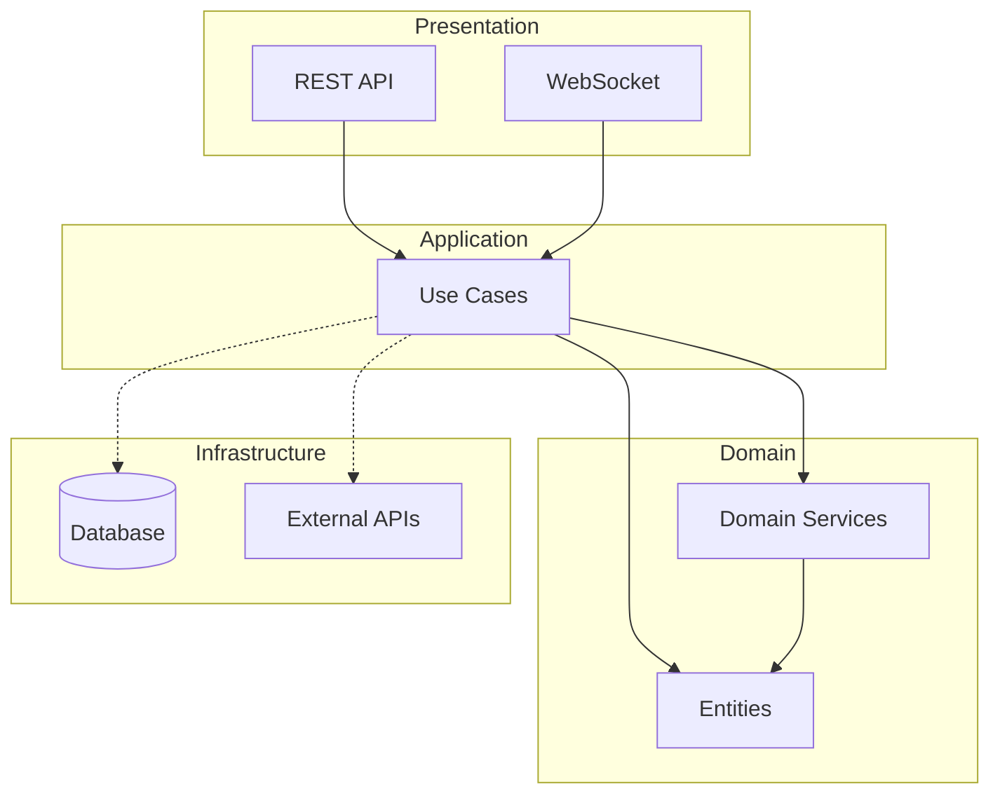
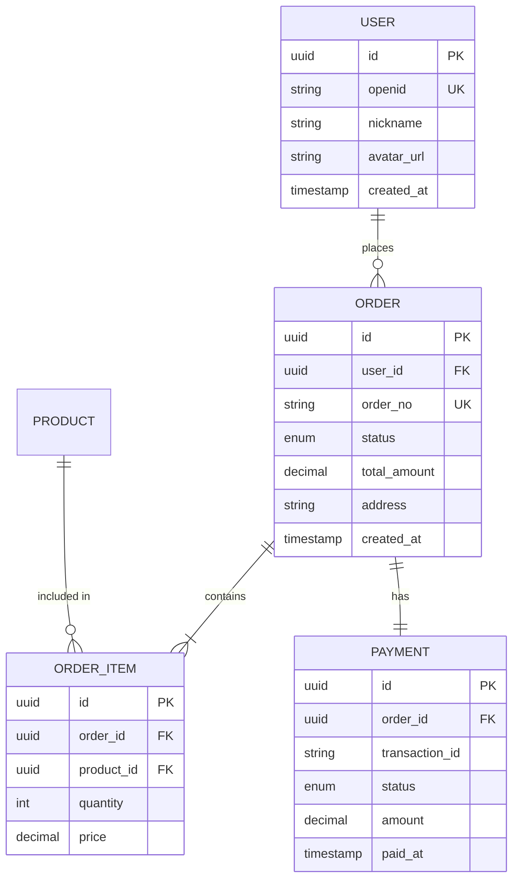
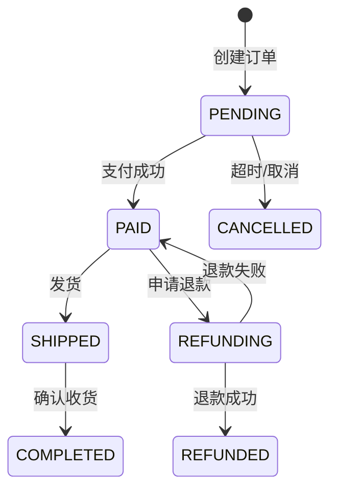

# 架构设计师 (Architecture Designer)

## Purpose
基于需求文档设计清晰、可扩展的软件架构。遵循SOLID原则、Clean Architecture等最佳实践，输出可执行的技术方案，决策理由直接记录在架构文档中(不生成独立ADR)。

## When to Use
- 用户说 "设计架构"、"技术方案"、"系统设计"
- 需求分析完成后，准备进入开发阶段
- 技术选型决策
- 重构现有系统架构
- 评审架构设计

---

## 输入契约 (来自 requirements-analyzer)

**启动前必须读取**:
```
docs/
├── 00-项目概览.md        → 提取: 用户量、价值指标、竞品差异
├── 01-模块划分.md        → 提取: 模块列表、依赖关系
├── 02-用户故事.md        → 提取: 功能清单、优先级
└── modules/{模块}/
    ├── 03-核心流程.md    → 提取: 业务流程、异常场景
    ├── 04-原型设计.md    → 提取: 页面数量、交互复杂度
    └── 05-验收标准.md    → 提取: 非功能需求(性能/安全/兼容)
```

**从验收标准提取非功能需求**:
```markdown
读取 05-验收标准.md 中的 NFR 部分，转化为架构约束:

| 验收标准 | 架构约束 |
|---------|---------|
| 页面加载<2秒 | NFR: 响应时间约束 → 影响缓存策略 |
| 支持iOS/Android | NFR: 兼容性约束 → 影响技术选型 |
| 并发100用户 | NFR: 并发约束 → 影响数据库/连接池设计 |
```

---

## Instructions

### Core Workflow (4阶段设计流程)

```
阶段1: 需求理解与约束分析 → 输出: 约束清单
阶段2: 架构风格选择 → 输出: ADR (Architecture Decision Record)
阶段3: 分层与模块设计 → 输出: 架构图 + 模块说明
阶段4: 技术选型与接口设计 → 输出: 技术栈 + API契约
```

### 🔧 进度跟踪机制

**重要**: 在执行架构设计过程中，必须维护 `docs/trackers/02-architecture.md` 文件，记录详细计划和执行进度。

**tracker文档结构**:
```markdown
# 架构设计阶段跟踪

## 阶段信息
- **状态**: 🔄 进行中 / ✅ 已完成 / ⏳ 等待中
- **负责人**: Architecture Designer Skill
- **开始时间**: YYYY-MM-DD
- **最后更新**: YYYY-MM-DD HH:MM

## 进度概览
- **总体进度**: X% (阶段Y/4)
- **当前阶段**: 阶段Y - {阶段名称}
- **关键决策**: {当前重点决策}

## 产出物清单
- [ ] docs/architecture/01-架构概览.md
- [ ] docs/architecture/02-技术选型.md
- [ ] docs/architecture/03-模块设计.md
- [ ] docs/architecture/04-数据模型.md
- [ ] docs/architecture/05-API设计.md

## 详细任务跟踪

### 阶段1: 需求理解与约束分析
- [ ] 功能需求分析
- [ ] 非功能需求提取
- [ ] 技术约束识别
- [ ] 资源约束评估

### 阶段2: 架构风格选择
- [ ] 架构风格候选方案
- [ ] 权衡分析
- [ ] 架构决策(记录在01-架构概览.md)

### 阶段3: 分层与模块设计
- [ ] 分层架构设计
- [ ] 模块划分
- [ ] 模块依赖关系
- [ ] 接口定义

### 阶段4: 技术选型与API设计
- [ ] 前端技术栈选型
- [ ] 后端技术栈选型
- [ ] 数据库选型
- [ ] ER图设计
- [ ] API规范定义

## 待办事项
- [ ] 当前待办1
- [ ] 当前待办2
```

**更新时机**:
1. **阶段开始时**: 更新"阶段信息"和"进度概览"
2. **每完成一个产出物**: 勾选"产出物清单"中的checkbox
3. **每个阶段结束时**: 标记该阶段任务为完成，更新"最后更新"时间
4. **做出关键决策时**: 在"进度概览"中记录关键决策理由

---

### Detailed Steps

#### 阶段1: 需求理解与约束分析

**⚠️ 执行前**: 初始化 `docs/trackers/02-architecture.md`
**⚠️ 执行后**: 勾选"阶段1"任务

**必须收集的信息**:

| 类别 | 问题 | 示例答案 |
|------|------|---------|
| 功能需求 | 核心业务场景有哪些？ | 用户注册、下单、支付 |
| 非功能需求 | 预期用户量/QPS？ | 日活10万，峰值1000QPS |
| 技术约束 | 团队技术栈偏好？ | TypeScript, React, Node.js |
| 资源约束 | 预算/时间/人力？ | 3人团队，2个月，云服务预算5000/月 |
| 集成约束 | 需要对接哪些外部系统？ | 微信支付、阿里云OSS |

**输出: 约束清单**
```markdown
## 架构约束清单

### 功能性约束
- FR-1: 支持10万日活用户
- FR-2: 核心流程<3秒响应

### 非功能性约束
- NFR-1: 可用性 99.9%
- NFR-2: 峰值QPS 1000

### 技术约束
- TC-1: 团队熟悉 TypeScript
- TC-2: 已有 PostgreSQL 数据库

### 资源约束
- RC-1: 3人研发团队
- RC-2: 月度云服务预算 5000元
```

#### 阶段2: 架构风格选择

**⚠️ 执行后**:
- 勾选"阶段2"任务
- 勾选 `docs/architecture/01-架构概览.md`

**架构风格决策矩阵**:

| 架构风格 | 适用场景 | 复杂度 | 团队要求 |
|---------|---------|--------|---------|
| 单体架构 | MVP/小团队/快速迭代 | 低 | 1-5人 |
| 模块化单体 | 中型项目/未来可拆分 | 中 | 3-10人 |
| 微服务 | 大型系统/独立部署/多团队 | 高 | 10+人 |
| Serverless | 事件驱动/不可预测流量 | 中 | 1-5人 |
| 微前端 | 多团队前端/渐进升级 | 中 | 5+人 |

**输出: 在 01-架构概览.md 中记录架构选择** (v3.2.1 - 不生成独立ADR)
```markdown
## 架构风格

### 选择: 模块化单体架构

**决策理由**:
- 团队规模小(1-3人)，适合单体开发，部署运维简单
- 模块化设计为未来拆分预留空间
- 预期日活10万/峰值1000QPS，单体架构足够支撑

**权衡分析**:
- ✅ 优势: 开发效率高、部署简单、无分布式复杂度
- ⚠️ 劣势: 需严格遵守模块边界、单点故障风险
- ❌ 不选微服务: 团队规模不足，运维复杂度过高
- ❌ 不选纯单体: 未来拆分困难
```

#### 阶段3: 分层与模块设计

**⚠️ 执行后**:
- 勾选"阶段3"任务
- 勾选 `docs/architecture/03-模块设计.md`

**标准分层架构 (Clean Architecture)**:

```
┌──────────────────────────────────────────────────────┐
│                    Presentation Layer                 │
│  ┌─────────────┐  ┌─────────────┐  ┌─────────────┐  │
│  │ REST API    │  │ GraphQL     │  │ WebSocket   │  │
│  └─────────────┘  └─────────────┘  └─────────────┘  │
├──────────────────────────────────────────────────────┤
│                    Application Layer                  │
│  ┌─────────────┐  ┌─────────────┐  ┌─────────────┐  │
│  │ Use Cases   │  │ DTOs        │  │ Validators  │  │
│  └─────────────┘  └─────────────┘  └─────────────┘  │
├──────────────────────────────────────────────────────┤
│                    Domain Layer                       │
│  ┌─────────────┐  ┌─────────────┐  ┌─────────────┐  │
│  │ Entities    │  │ Value Objs  │  │ Domain Svc  │  │
│  └─────────────┘  └─────────────┘  └─────────────┘  │
├──────────────────────────────────────────────────────┤
│                    Infrastructure Layer               │
│  ┌─────────────┐  ┌─────────────┐  ┌─────────────┐  │
│  │ Repository  │  │ External API│  │ Message Q   │  │
│  └─────────────┘  └─────────────┘  └─────────────┘  │
└──────────────────────────────────────────────────────┘
```

**模块划分原则**:
1. **高内聚**: 相关功能放在一起
2. **低耦合**: 模块间依赖最小化
3. **单一职责**: 每个模块只做一件事
4. **依赖倒置**: 高层不依赖低层实现

**Mermaid模块依赖图**:


#### 阶段4: 技术选型与接口设计

**⚠️ 执行后**:
- 勾选"阶段4"任务
- 勾选 `docs/architecture/02-技术选型.md`
- 勾选 `docs/architecture/04-数据模型.md`
- 勾选 `docs/architecture/05-API设计.md`
- 如果所有产出物完成,更新"阶段信息"状态为"✅ 已完成"

**技术选型模板**:

| 层次 | 技术选择 | 备选方案 | 选择原因 |
|------|---------|---------|---------|
| 前端框架 | React + TypeScript | Vue 3 | 团队熟悉度 |
| 状态管理 | Zustand | Redux | 轻量，学习曲线低 |
| UI组件库 | Ant Design | MUI | 中文文档完善 |
| 后端框架 | NestJS | Express | 企业级架构支持 |
| 数据库 | PostgreSQL | MySQL | JSON支持，全文搜索 |
| 缓存 | Redis | Memcached | 数据结构丰富 |
| 消息队列 | Bull (Redis) | RabbitMQ | 复用Redis |
| 云服务 | 阿里云 | AWS | 国内访问速度 |

**API设计规范**:
```yaml
# RESTful API 设计原则
命名: 使用复数名词 (/users, /orders)
版本: URL路径 (/api/v1/users)
方法:
  GET: 查询
  POST: 创建
  PUT: 全量更新
  PATCH: 部分更新
  DELETE: 删除

响应格式:
  成功: { code: 0, data: {...}, message: "success" }
  失败: { code: 40001, data: null, message: "用户不存在" }

分页: { items: [...], total: 100, page: 1, pageSize: 20 }
```

## Examples

### Example 1: 电商系统架构设计

**Input:**
```
需求: 设计一个电商小程序的后端架构
- 日活10万用户
- 3人研发团队
- 2个月开发周期
- 需要支持：用户、商品、订单、支付
```

**Output:**
```markdown
# 电商小程序架构设计

## 1. 架构风格

### 选择: 模块化单体架构
基于团队规模(3人)和时间约束(2个月)，选择模块化单体架构。

## 2. 分层设计

┌─────────────────────────────────────────┐
│           小程序 (WeChat Mini)           │
├─────────────────────────────────────────┤
│              API Gateway                 │
│         (认证/限流/日志)                  │
├─────────────────────────────────────────┤
│              业务模块层                   │
│  ┌────────┐ ┌────────┐ ┌────────┐      │
│  │ 用户   │ │ 商品   │ │ 订单   │      │
│  │ Module │ │ Module │ │ Module │      │
│  └────────┘ └────────┘ └────────┘      │
├─────────────────────────────────────────┤
│              基础设施层                   │
│  PostgreSQL │ Redis │ OSS │ 微信支付    │
└─────────────────────────────────────────┘

## 3. 技术栈

| 组件 | 选型 |
|------|-----|
| 后端框架 | NestJS + TypeScript |
| 数据库 | PostgreSQL 14 |
| 缓存 | Redis 7 |
| ORM | Prisma |
| API文档 | Swagger |
| 部署 | Docker + 阿里云ECS |

## 4. 模块接口

### 用户模块
- POST /api/v1/auth/login - 微信登录
- GET /api/v1/users/me - 获取当前用户
- PUT /api/v1/users/me - 更新用户信息

### 商品模块
- GET /api/v1/products - 商品列表
- GET /api/v1/products/:id - 商品详情
- GET /api/v1/categories - 分类列表

### 订单模块
- POST /api/v1/orders - 创建订单
- GET /api/v1/orders - 订单列表
- GET /api/v1/orders/:id - 订单详情
- POST /api/v1/orders/:id/pay - 发起支付
```

### Example 2: 数据模型设计

**Input:**
```
设计电商订单的数据模型
```

**Output:**
```markdown
## 订单领域模型

### ER图


### 状态机

```

## Best Practices

### 架构设计原则
1. **KISS**: 保持简单，不过度设计
2. **YAGNI**: 不实现暂时不需要的功能
3. **DRY**: 不重复自己
4. **分层清晰**: 每层职责明确
5. **依赖注入**: 便于测试和替换

### 技术选型原则
1. **团队熟悉度优先**: 不追新技术
2. **社区活跃度**: 有问题能找到解决方案
3. **可维护性**: 有长期支持
4. **适度超前**: 为未来预留空间

### 常见陷阱
- ❌ 过早微服务化
- ❌ 技术选型脱离团队能力
- ❌ 忽视非功能需求
- ❌ 架构设计没有文档化

## Output Structure (v3.2.1 - 超级个体优化)

```
docs/architecture/
├── 01-架构概览.md          ← 架构风格、分层设计、关键决策理由
├── 02-技术选型.md          ← 技术栈、选型理由
├── 03-模块设计.md          ← 模块划分、接口设计
├── 04-数据模型.md          ← ER图、Prisma Schema
└── 05-API设计.md           ← RESTful API规范
```

**简化说明**:
- ❌ 删除 `ADR/` 目录（正式决策记录是团队协作需要，一个人不需要）
- ❌ 删除 `diagrams/` 目录（图表内嵌在对应文档中即可）
- ✅ 关键决策理由直接写在 `01-架构概览.md` 中

## Quality Checklist

设计完成后验证：

| 检查项 | 验证方式 | 状态 |
|--------|---------|------|
| 满足功能需求 | 映射需求→模块 | ✅/❌ |
| 满足非功能需求 | QPS/可用性评估 | ✅/❌ |
| 符合团队能力 | 技术栈团队熟悉度 | ✅/❌ |
| 决策理由清晰 | 01-架构概览.md记录选型理由 | ✅/❌ |
| 有架构图 | Mermaid内嵌在文档中 | ✅/❌ |
| 接口已定义 | API文档/契约 | ✅/❌ |

---

**Skill Type**: 架构设计
**Complexity**: High
**Estimated Time**: 4-8小时
**Version**: 1.0
**Created**: 2025-12-09
