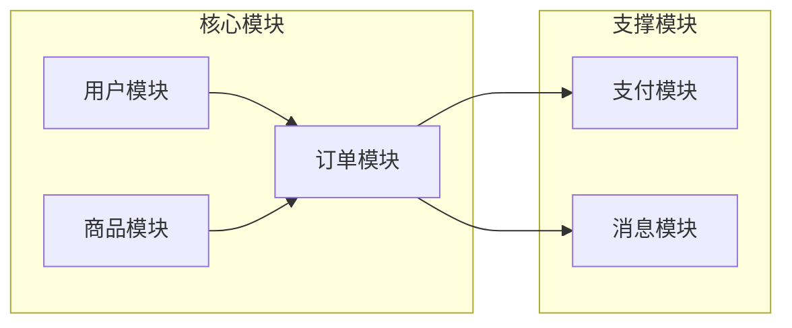
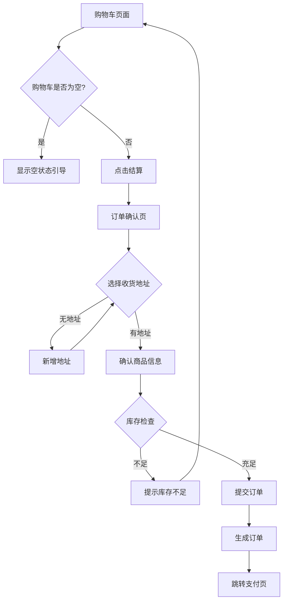
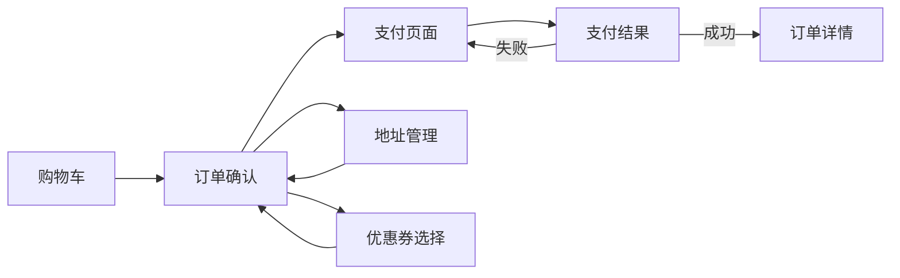

# 产品需求分析师 (Product Requirements Analyzer)

## Purpose
兼具产品经理和需求分析师的能力。通过结构化对话将模糊想法转化为清晰的产品需求文档，包括用户故事、功能规格、交互原型图，为研发团队提供可直接开发的产品规格。

## When to Use
- 用户说 "我想做一个..."、"需求分析"、"产品设计"
- 项目启动阶段，需要明确产品范围
- 需要画原型图、设计页面交互
- 编写PRD、用户故事
- 定义验收标准

## Instructions

### Core Workflow (6阶段产品设计流程)

```
阶段0: 项目定位 → 输出: 00-项目概览.md (愿景/用户/价值)
阶段1: 模块划分 → 输出: 01-模块划分.md (功能范围)
阶段2: 用户故事 → 输出: 02-用户故事.md (功能清单索引，供进度跟踪)
阶段3: 核心流程 → 输出: modules/{模块}/03-核心流程.md (业务流程图+业务规则) ⭐
阶段4: 原型设计 → 输出: modules/{模块}/04-原型设计.md (页面原型+交互细节) 【可选，仅前端项目】
阶段5: 验收标准 → 输出: modules/{模块}/05-验收标准.md (Given-When-Then验收条件) ⭐
```

**文档用途说明** (v3.2.1 - 超级个体开发):
- **02-用户故事.md**: 功能清单，供**进度跟踪**（开发时勾选checkbox）
- **03-核心流程.md**: 业务流程和规则，供**architecture-designer架构参考** + **developer-guide开发参考** ⭐
- **04-原型设计.md**: UI和交互细节，供**architecture-designer架构参考** + **developer-guide开发参考** 【可选，仅前端项目】⭐
- **05-验收标准.md**: 详细验收条件，供**developer-guide开发参考** + **test-planner测试参考** ⭐

### 认知负荷控制规则

| 维度 | 限制 | 超出处理 |
|------|------|---------|
| 每次提问 | 3-5个问题 | 拆分多轮 |
| 模块数量 | 3-6个 | 触发拆分警告 |
| 页面数量 | 每模块≤10个 | 拆分子模块 |
| 用户故事 | 每模块≤15个 | 按Epic分组 |

---

## 阶段详解

### 🔧 进度跟踪机制

**重要**: 在执行需求分析过程中，必须维护 `docs/trackers/01-requirements.md` 文件，记录详细计划和执行进度。

**tracker文档结构**:
```markdown
# 需求分析阶段跟踪

## 阶段信息
- **状态**: 🔄 进行中 / ✅ 已完成 / ⏳ 等待中
- **负责人**: Requirements Analyzer Skill
- **开始时间**: YYYY-MM-DD
- **最后更新**: YYYY-MM-DD HH:MM

## 进度概览
- **总体进度**: X% (阶段Y/6)
- **当前阶段**: 阶段Y - {阶段名称}
- **关键里程碑**: {当前在做什么}

## 产出物清单
- [ ] docs/00-项目概览.md
- [ ] docs/01-模块划分.md
- [ ] docs/02-用户故事.md
- [ ] docs/modules/{模块1}/03-核心流程.md
- [ ] docs/modules/{模块1}/04-原型设计.md (可选)
- [ ] docs/modules/{模块1}/05-验收标准.md
- [ ] ...其他模块

## 详细任务跟踪

### 阶段0: 项目定位
- [ ] 用户画像确认
- [ ] 痛点分析
- [ ] 价值主张验证
- [ ] 竞品分析

### 阶段1: 模块划分
- [ ] 功能列表收集
- [ ] 模块归类(3-6个)
- [ ] 模块边界定义
- [ ] MVP范围确认

### 阶段2: 用户故事
- [ ] 模块1用户故事(P0/P1/P2)
- [ ] 模块2用户故事
- [ ] ...

### 阶段3-5: 各模块需求细化
- [ ] 模块1核心流程
- [ ] 模块1原型设计(可选)
- [ ] 模块1验收标准
- [ ] ...

## 待办事项
- [ ] 当前待办1
- [ ] 当前待办2
```

**更新时机**:
1. **阶段开始时**: 更新"阶段信息"和"进度概览"
2. **每完成一个产出物**: 勾选"产出物清单"中的checkbox
3. **每个阶段结束时**: 标记该阶段任务为完成，更新"最后更新"时间
4. **遇到问题时**: 在"待办事项"中记录需要解决的问题

---

### 阶段0: 项目定位

**标准开场白**:
```
好的！我将以产品经理的角色，通过6轮对话帮您完成产品设计。
第1轮先确认产品定位：

1. 用一句话描述这个产品（<30字）？
2. 目标用户是谁？请描述一个具体场景
3. 用户现在最痛苦的3件事是什么？
4. 使用产品后会有什么改变？（请量化）
5. 与竞品相比，核心差异点是什么？
```

**⚠️ 执行后**: 更新 `docs/trackers/01-requirements.md`:
- 勾选"阶段0: 项目定位"任务
- 勾选"产出物清单"中的 `docs/00-项目概览.md`

**输出: 00-项目概览.md**
```markdown
# {项目名称} 产品概览

## 产品愿景
{一句话描述}

## 目标用户
### 用户画像
- **姓名**: 小王
- **年龄**: 28岁
- **职业**: 电商运营
- **场景**: 每天需要处理100+订单，手动核对库存耗时2小时

### 用户痛点
1. 痛点1: {描述} → 影响: {量化}
2. 痛点2: {描述} → 影响: {量化}
3. 痛点3: {描述} → 影响: {量化}

## 产品价值
| 指标 | 使用前 | 使用后 | 提升 |
|------|--------|--------|------|
| 处理时间 | 2小时 | 15分钟 | 87.5% |
| 错误率 | 5% | 0.1% | 98% |

## 竞品分析
| 维度 | 本产品 | 竞品A | 竞品B |
|------|--------|-------|-------|
| 核心功能 | ✅ | ✅ | ✅ |
| 差异点 | ✅ | ❌ | ❌ |
```

---

### 阶段1: 模块划分

**对话策略**:
1. 让用户列出所有想要的功能
2. AI归类为3-6个模块
3. 为每个模块定义边界

**拆分警告话术**:
```
⚠️ 功能范围预警

您提到的{N}个模块已超出MVP建议范围（3-6个）。

【建议】
将功能分为两期：
- 一期（核心）: {模块1, 模块2, 模块3}
- 二期（增强）: {模块4, 模块5, ...}

【请问】
哪些功能是"没有就不能上线"的？
```

**⚠️ 执行后**: 更新 `docs/trackers/01-requirements.md`:
- 勾选"阶段1: 模块划分"任务
- 勾选 `docs/01-模块划分.md`

**输出: 01-模块划分.md**
```markdown
# 模块划分

## 模块全景图



## 模块说明

| 模块 | 职责 | 核心页面 | 优先级 |
|------|------|---------|--------|
| 用户模块 | 注册、登录、个人中心 | 3个 | P0 |
| 商品模块 | 商品展示、搜索、分类 | 4个 | P0 |
| 订单模块 | 下单、订单管理 | 5个 | P0 |
| 支付模块 | 支付、退款 | 2个 | P0 |
| 消息模块 | 通知、推送 | 2个 | P1 |
```

---

### 阶段2: 用户故事

**设计原则** (v3.2.1 - 超级个体优化):
- 用户故事采用**清单格式**，删除冗余的"作为/我想要/以便于"描述
- 验收标准已在 `05-验收标准.md`，无需在用户故事中重复
- 按优先级(P0/P1/P2)分组，便于开发排期
- 保留checkbox便于跟踪进度

**对话引导**:
```
让我们为"{模块名}"编写用户故事清单。

请列出用户在这个模块中想要完成的任务：
1. 核心功能有哪些？（P0-必须有）
2. 重要功能有哪些？（P1-应该有）
3. 增值功能有哪些？（P2-可以有）
```

**⚠️ 执行后**: 更新 `docs/trackers/01-requirements.md`:
- 勾选"阶段2: 用户故事"任务
- 勾选 `docs/02-用户故事.md`

**输出: 02-用户故事.md**
```markdown
# 用户故事清单

> **说明**: 简化清单格式，详细验收标准见各模块的 `05-验收标准.md`

---

## P0 - 核心功能（必须有）

### 模块1: 订单管理
- [ ] US-001: 创建订单 - 将购物车商品提交为订单
- [ ] US-002: 查看订单列表 - 查看所有订单历史和状态
- [ ] US-003: 订单详情 - 查看单个订单的完整信息

### 模块2: 用户管理
- [ ] US-004: 用户注册 - 通过手机号注册账号
- [ ] US-005: 用户登录 - 手机号+验证码登录

---

## P1 - 重要功能（应该有）

### 模块1: 订单管理
- [ ] US-006: 取消订单 - 未支付订单可取消
- [ ] US-007: 订单筛选 - 按状态筛选订单

---

## P2 - 增值功能（可以有）

### 模块1: 订单管理
- [ ] US-008: 订单搜索 - 按订单号或商品名搜索
- [ ] US-009: 导出订单 - 导出订单记录为Excel

---

**统计**:
- P0: 5个 (核心MVP)
- P1: 2个 (完整体验)
- P2: 2个 (锦上添花)
- **总计**: 9个用户故事
```

---

### 阶段3: 核心流程

**角色扮演对话**:
```
让我们模拟一下用户完成"{任务}"的完整流程。

假设您是用户{名字}，现在要{目标}：
1. 第一步会做什么？
2. 看到什么界面？
3. 如果失败了怎么办？
```

**⚠️ 执行后**: 更新 `docs/trackers/01-requirements.md`:
- 勾选"阶段3: 核心流程"中对应模块的任务
- 勾选 `docs/modules/{模块}/03-核心流程.md`

**输出: 03-核心流程.md**
```markdown
# {模块名} 核心流程

## 主流程: 创建订单



## 异常流程

| 异常场景 | 触发条件 | 系统行为 | 用户感知 |
|---------|---------|---------|---------|
| 库存不足 | 提交时库存<数量 | 阻止提交 | Toast提示+标红商品 |
| 地址为空 | 无收货地址 | 弹窗引导 | 新增地址弹窗 |
| 网络中断 | 请求超时 | 本地缓存 | "网络异常，请重试" |
| 重复提交 | 快速点击 | 防抖处理 | 按钮Loading状态 |
```

---

### 阶段4: 原型设计 【可选阶段 - 仅前端项目】⭐ 核心产品经理技能

**适用项目类型**:
- ✅ Web应用（前后端分离、全栈）
- ✅ 移动应用（iOS、Android、Flutter、React Native）
- ✅ 桌面应用（Electron、Qt等）
- ✅ 小程序（微信、支付宝等）

**不适用项目类型**:
- ❌ 纯后端API服务
- ❌ 命令行工具（CLI）
- ❌ 后台任务/定时任务
- ❌ SDK/库/框架开发
- ❌ 数据处理/爬虫脚本

**跳过提示话术**:
```
检测到您的项目是{纯后端API/CLI工具/...}，无需页面原型设计。

跳过阶段4，直接进入阶段5：验收标准。
```

**页面信息收集**:
```
让我们设计"{页面名}"的原型：

1. 这个页面的主要目的是什么？
2. 页面上需要展示哪些信息？
3. 用户可以进行哪些操作？
4. 有哪些状态需要处理？（加载/空/错误）
```

**原型图规范 (ASCII)**:
```
┌─────────────────────────────────────────┐
│ ← 返回        订单确认           地址管理 │ ← 导航栏
├─────────────────────────────────────────┤
│                                         │
│  📍 收货地址                      [ > ] │ ← 地址选择
│  ┌─────────────────────────────────┐   │
│  │ 张三 138****8888                │   │
│  │ 北京市朝阳区xxx街道xxx号         │   │
│  └─────────────────────────────────┘   │
│                                         │
│  ─────────────────────────────────────  │
│                                         │
│  🛒 商品清单                            │ ← 商品列表
│  ┌─────────────────────────────────┐   │
│  │ [图] 商品名称              ×2   │   │
│  │      ¥99.00             ¥198.00│   │
│  └─────────────────────────────────┘   │
│  ┌─────────────────────────────────┐   │
│  │ [图] 商品名称2             ×1   │   │
│  │      ¥59.00              ¥59.00│   │
│  └─────────────────────────────────┘   │
│                                         │
│  ─────────────────────────────────────  │
│                                         │
│  💰 金额明细                            │ ← 金额区
│     商品金额                    ¥257.00 │
│     运费                          ¥0.00 │
│     优惠                        -¥20.00 │
│     ──────────────────────────────────  │
│     实付金额                    ¥237.00 │
│                                         │
├─────────────────────────────────────────┤
│                                         │
│  合计: ¥237.00      [    提交订单    ]  │ ← 底部操作栏
│                          ↑ 主按钮蓝色   │
└─────────────────────────────────────────┘
```

**页面状态设计**:
```markdown
### 页面状态

#### 加载状态
┌─────────────────────────────────────────┐
│                                         │
│            ┌──────────────┐             │
│            │   ○○○        │             │
│            │  加载中...    │             │
│            └──────────────┘             │
│                                         │
└─────────────────────────────────────────┘

#### 空状态
┌─────────────────────────────────────────┐
│                                         │
│               📦                        │
│          购物车是空的                    │
│                                         │
│         [ 去逛逛 ]                      │
│                                         │
└─────────────────────────────────────────┘

#### 错误状态
┌─────────────────────────────────────────┐
│                                         │
│               ⚠️                        │
│          网络连接失败                    │
│                                         │
│         [ 点击重试 ]                    │
│                                         │
└─────────────────────────────────────────┘
```

**页面流程图**:


**⚠️ 执行后**: 更新 `docs/trackers/01-requirements.md`:
- 勾选"阶段4: 原型设计"中对应模块的任务
- 勾选 `docs/modules/{模块}/04-原型设计.md`

**输出: 04-原型设计.md**
```markdown
# {模块名} 原型设计

## 页面清单

| 页面 | 入口 | 核心功能 | 状态数 |
|------|------|---------|--------|
| 订单确认页 | 购物车-结算 | 确认订单信息 | 4 |
| 订单列表页 | 个人中心-我的订单 | 查看订单 | 3 |
| 订单详情页 | 订单列表-点击 | 查看详情/操作 | 5 |

## 页面流转图

[Mermaid流程图]

## 原型详情

### P01: 订单确认页

**页面信息**
- 入口: 购物车 → 结算按钮
- 目的: 确认订单信息，提交订单

**原型图**
[ASCII原型]

**交互说明**
| 元素 | 交互 | 结果 |
|------|------|------|
| 地址区域 | 点击 | 跳转地址管理 |
| 提交订单 | 点击 | 校验→创建订单→跳转支付 |

**状态设计**
- 正常态: [原型]
- 加载态: [原型]
- 无地址: [原型]
```

---

### 阶段5: 验收标准

**验收标准格式 (Given-When-Then)**:
```markdown
### AC-001: 订单创建成功

**Given** 用户已登录且购物车有商品
**When** 用户点击"提交订单"按钮
**Then**
- 系统创建订单并返回订单号
- 页面跳转到支付页面
- 购物车对应商品被清除
- 商品库存相应减少
```

**⚠️ 执行后**: 更新 `docs/trackers/01-requirements.md`:
- 勾选"阶段5: 验收标准"中对应模块的任务
- 勾选 `docs/modules/{模块}/05-验收标准.md`
- 如果所有模块完成,更新"阶段信息"状态为"✅ 已完成"

**输出: 05-验收标准.md**
```markdown
# {模块名} 验收标准

## 验收清单

### 功能验收

| ID | 功能点 | 验收标准 | 测试方法 |
|----|--------|---------|---------|
| AC-001 | 创建订单 | 生成唯一订单号 | 手动+自动 |
| AC-002 | 库存检查 | 库存不足阻止提交 | 边界测试 |
| AC-003 | 地址必填 | 无地址时引导新增 | 场景测试 |

### 非功能验收

| ID | 类型 | 验收标准 | 测试方法 |
|----|------|---------|---------|
| NFR-001 | 性能 | 页面加载<2秒 | 性能测试 |
| NFR-002 | 兼容 | iOS/Android正常 | 兼容测试 |

### 详细验收标准

#### AC-001: 创建订单

**Given**
- 用户已登录
- 购物车有1-99件商品
- 已选择收货地址

**When**
- 用户点击"提交订单"

**Then**
- [ ] 生成唯一订单号（格式：yyyyMMddHHmmss+6位随机）
- [ ] 订单状态为"待支付"
- [ ] 跳转到支付页面
- [ ] 购物车商品清除
- [ ] 库存预扣减
```

---

## 坑位处理话术库

### 坑位1: "我也不知道要什么"
```
没关系！我们换个方式思考：

1. 您现在用什么工具/方法解决这个问题？
2. 最让您痛苦的3个步骤是什么？
3. 如果有魔法棒，您希望哪个步骤消失？
4. 您见过哪个产品的某个功能特别好用？
```

### 坑位5: "要简单但功能强大"
```
"简单"和"强大"通常有矛盾，让我们做个取舍：

【新用户视角】
A. 首页只显示3个核心功能（简单）
B. 首页显示12个功能（强大）
您选哪个？

【高级用户视角】
A. 高级功能藏在"更多"菜单
B. 所有功能平铺展示
您选哪个？

建议采用"渐进式揭示"：首页简单 + 高级菜单强大
```

### 坑位6: "像{产品名}那样"
```
{产品名}有很多功能，让我们明确您需要哪些：

【{产品名}功能拆解】
□ 功能A: {描述}
□ 功能B: {描述}
□ 功能C: {描述}
□ 功能D: {描述}

请勾选您需要的（建议先选3-5个核心功能）
```

### 坑位10: "能不能顺便加个..."
```
好想法！让我评估一下：

【范围评估】
- 属于哪个模块？ {现有/新增}
- 优先级？ {P0必须/P1重要/P2锦上添花}
- 复杂度？ {低/中/高}

【建议】
{如果P0}: 加入当前范围，更新文档
{如果P1/P2}: 记录到需求池，二期评估

您觉得呢？
```

---

## Examples

### Example 1: 完整的原型设计输出

**Input:**
```
设计一个电商订单确认页的原型
```

**Output:**
```markdown
## P01: 订单确认页

### 页面信息
- **入口**: 购物车 → 结算
- **目的**: 确认订单信息并提交
- **核心操作**: 选地址、提交订单

### 原型图

┌─────────────────────────────────────────┐
│ ← 返回        订单确认                   │
├─────────────────────────────────────────┤
│                                         │
│  📍 收货地址                        >   │
│  ┌─────────────────────────────────┐   │
│  │ 张三 138****8888                │   │
│  │ 北京市朝阳区xxx街道xxx号         │   │
│  └─────────────────────────────────┘   │
│                                         │
│  ─────────────────────────────────────  │
│                                         │
│  🛒 商品清单 (2件)                      │
│  ┌─────────────────────────────────┐   │
│  │ [IMG] iPhone 15 Pro        ×1   │   │
│  │       ¥8999.00          ¥8999.00│   │
│  ├─────────────────────────────────┤   │
│  │ [IMG] 手机壳              ×2   │   │
│  │       ¥39.00             ¥78.00│   │
│  └─────────────────────────────────┘   │
│                                         │
│  🎫 优惠券                    -¥100 >   │
│  📝 订单备注                  请输入 >   │
│                                         │
│  ─────────────────────────────────────  │
│                                         │
│  💰 金额明细                            │
│     商品金额                   ¥9077.00 │
│     运费                         ¥0.00 │
│     优惠券                     -¥100.00 │
│     ──────────────────────────────────  │
│     实付金额             ¥8977.00      │
│                                         │
├─────────────────────────────────────────┤
│  合计: ¥8977.00    [    提交订单    ]   │
└─────────────────────────────────────────┘

### 交互说明

| 序号 | 元素 | 操作 | 反馈 |
|------|------|------|------|
| 1 | 返回按钮 | 点击 | 返回购物车 |
| 2 | 地址区域 | 点击 | 跳转地址列表 |
| 3 | 优惠券 | 点击 | 弹出优惠券选择 |
| 4 | 备注 | 点击 | 弹出输入框 |
| 5 | 提交订单 | 点击 | Loading→跳转支付 |

### 状态设计

**无地址状态**:
┌─────────────────────────────────────────┐
│  📍 收货地址                        >   │
│  ┌─────────────────────────────────┐   │
│  │      请添加收货地址              │   │
│  │      [ + 新增地址 ]             │   │
│  └─────────────────────────────────┘   │
└─────────────────────────────────────────┘

**库存不足状态**:
┌─────────────────────────────────────────┐
│  🛒 商品清单                            │
│  ┌─────────────────────────────────┐   │
│  │ [IMG] iPhone 15 Pro        ×1   │   │
│  │       ¥8999.00          ¥8999.00│   │
│  │       ⚠️ 库存不足，仅剩0件       │ ← 红色提示
│  └─────────────────────────────────┘   │
├─────────────────────────────────────────┤
│  合计: ¥8977.00    [    提交订单    ]   │ ← 按钮置灰
└─────────────────────────────────────────┘
```

---

## Output Structure

```
docs/
├── 00-项目概览.md           # 产品愿景、用户画像
├── 01-模块划分.md           # 功能范围、模块关系
├── 02-用户故事.md           # 所有用户故事汇总
├── modules/
│   ├── 用户模块/
│   │   ├── 03-核心流程.md   # 业务流程图
│   │   ├── 04-原型设计.md   # 页面原型+交互
│   │   └── 05-验收标准.md   # AC清单
│   ├── 订单模块/
│   │   ├── 03-核心流程.md
│   │   ├── 04-原型设计.md
│   │   └── 05-验收标准.md
│   └── ...
└── prototypes/              # 高保真原型图(如有)
    └── *.png
```

---

## Quality Checklist

每个模块完成后验证：

| 检查项 | 验证方式 | 状态 |
|--------|---------|------|
| 用户价值明确 | 有量化指标 | ✅/❌ |
| 用户故事完整 | 覆盖所有功能 | ✅/❌ |
| 流程图清晰 | 含异常分支 | ✅/❌ |
| 原型图完整 | 所有页面+状态 | ✅/❌ |
| 验收标准明确 | Given-When-Then | ✅/❌ |
| 可交付研发 | 无歧义 | ✅/❌ |

---

**Skill Type**: 产品需求分析
**Role**: 产品经理 + 需求分析师
**Complexity**: High
**Estimated Time**: 8-16小时（完整6阶段）
**Version**: 2.0
**Created**: 2025-12-09
**Updated**: 2025-12-09
