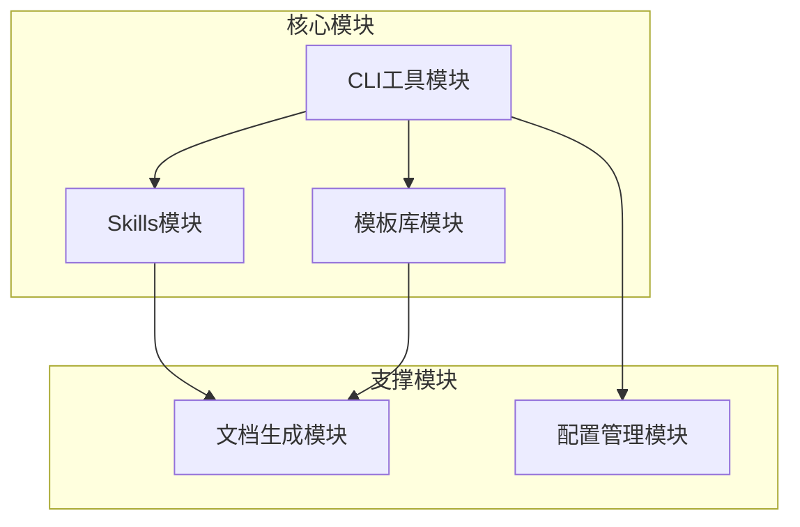
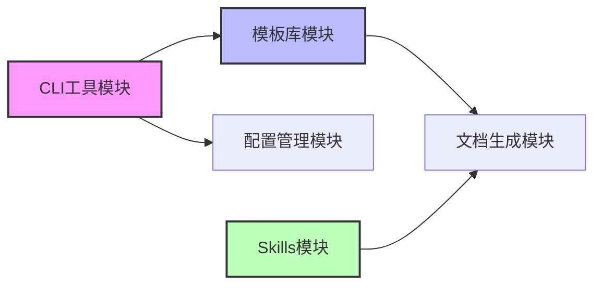

# AI 超级个体开发模板系统 - 模块划分

## 模块全景图

## 模块说明

| 模块 | 职责 | 核心功能 | 优先级 | 依赖 |
|------|------|---------|--------|------|
| **CLI工具模块** | 提供命令行工具，用户交互入口 | 项目初始化、模板选择、安装 | P0 | 模板库、配置管理 |
| **模板库模块** | 存储和管理各类项目模板 | 基础模板、项目类型模板、模板注册 | P0 | - |
| **Skills模块** | 提供 4 个专业 AI 技能 | 需求分析、架构设计、开发指导、测试规划 | P0 | 文档生成 |
| **文档生成模块** | 自动生成各类项目文档 | PRD生成、进度跟踪、文档模板 | P0 | - |
| **配置管理模块** | 管理 Claude Code 配置 | settings.json、.gitignore | P1 | - |

## 模块边界定义

### 模块1: CLI工具模块
**职责范围**
- 用户命令交互（init, list, --help）
- 项目初始化流程编排
- 模板选择和安装
- Git 仓库初始化

**不负责**
- ❌ 模板内容管理（由模板库模块负责）
- ❌ AI Skills 逻辑（由 Skills 模块负责）

### 模块2: 模板库模块
**职责范围**
- 存储基础模板（.claude/、CLAUDE.md等）
- 存储项目类型模板（web-fullstack、mobile-app等）
- 模板注册表管理
- 模板元数据定义

**不负责**
- ❌ 模板安装逻辑（由 CLI 工具负责）
- ❌ 模板内容生成（由文档生成模块负责）

### 模块3: Skills模块
**职责范围**
- requirements-analyzer Skill（需求分析）
- architecture-designer Skill（架构设计）
- developer-guide Skill（开发指导）
- test-planner Skill（测试规划）
- Skill 元数据定义（SKILL.md）

**不负责**
- ❌ 文档物理生成（由文档生成模块负责）
- ❌ 进度跟踪 UI（由 Claude Code 自带）

### 模块4: 文档生成模块
**职责范围**
- PRD 生成器（AI + 程序协作）
- 业务实体关系图生成
- Mermaid 图表渲染
- 文档模板填充

**不负责**
- ❌ 文档内容分析（由 AI Skills 负责）
- ❌ 用户交互（由 CLI 工具负责）

### 模块5: 配置管理模块
**职责范围**
- .claude/settings.json 配置
- .gitignore 规则
- package.json 依赖管理

**不负责**
- ❌ 项目业务配置（由用户自己管理）

## MVP 范围确认

### v1.0 MVP 包含（必须有）
- ✅ CLI 工具：init 命令
- ✅ 基础模板：.claude/ + CLAUDE.md + Skills
- ✅ 4个项目类型模板：web-fullstack, mobile-app, backend-api, cli-tool
- ✅ 4个 Skills：完整的 SKILL.md
- ✅ PRD 生成器：手动触发，生成完整 PRD

### v1.1 增强功能（应该有）
- ⏳ CLI 工具：upgrade 命令（升级模板）
- ⏳ 更多项目类型：desktop-app, sdk-library
- ⏳ PRD 导出为 PDF
- ⏳ 文档模板自定义

### v2.0 高级功能（可以有）
- ⏳ 在线模板市场
- ⏳ 社区 Skills 分享
- ⏳ VS Code 插件
- ⏳ 项目健康度检查

## 模块依赖关系

**关键依赖说明**
1. CLI 依赖 模板库：必须先有模板，才能安装
2. Skills 依赖 文档生成：需要生成文档产物
3. 所有模块独立，可以单独开发和测试

---

**文档版本**: v1.0
**创建日期**: 2025-12-10
