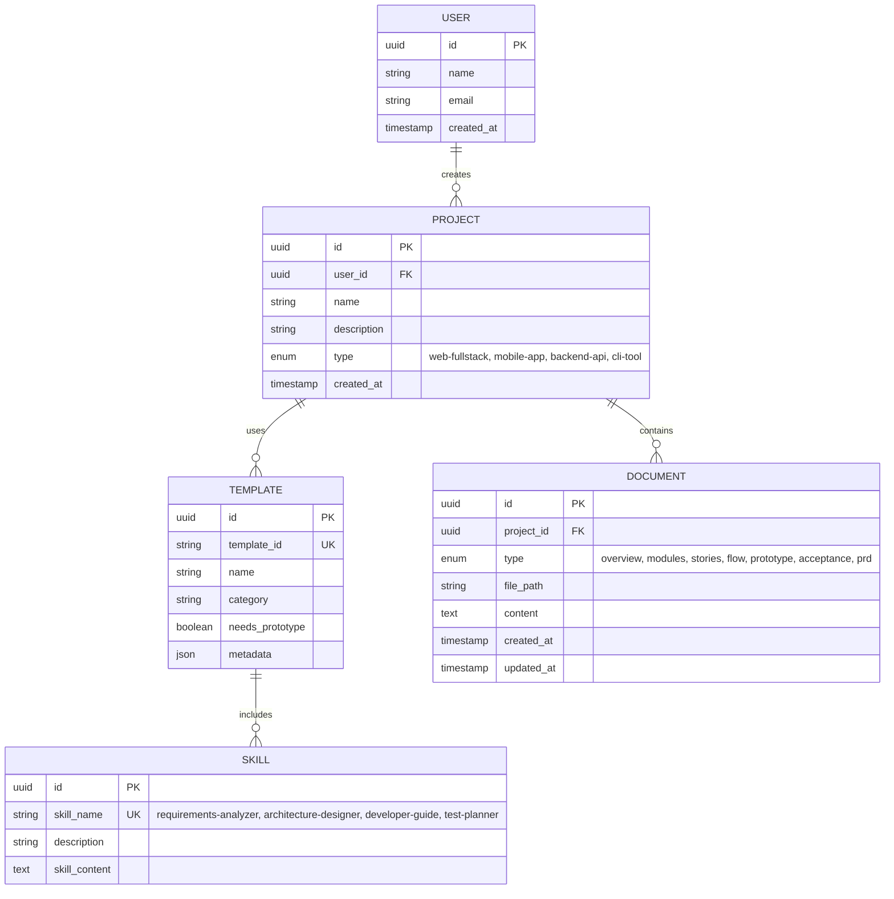
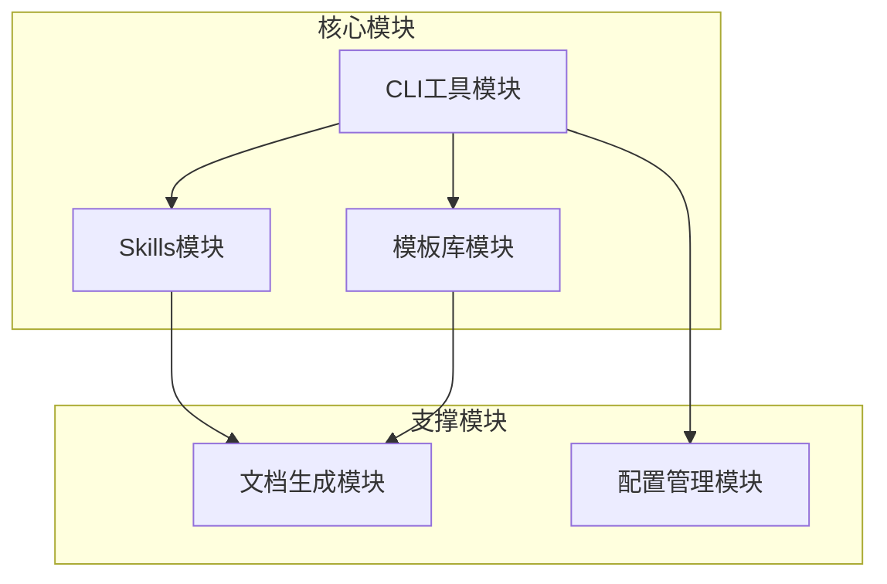
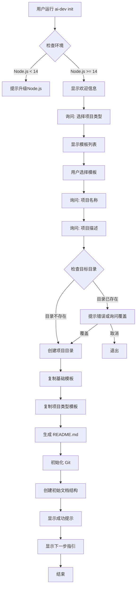

# AI 超级个体开发模板系统 产品需求文档

> **文档版本**: v1.0
> **创建日期**: 2025-12-10
> **最后更新**: 2025-12-10
> **产品负责人**: 开发团队
> **文档状态**: ✅ 需求分析完成

---

## 📑 目录

- [1. 产品概述](#1-产品概述)
- [2. 业务模型](#2-业务模型)
- [3. 功能规划](#3-功能规划)
- [4. 核心功能详解](#4-核心功能详解)
- [5. 非功能需求](#5-非功能需求)
- [6. 项目规划](#6-项目规划)
- [附录](#附录)

---

## 1. 产品概述

### 1.1 产品定位
为一个人开发软件提供标准化的 AI 辅助开发流程和工具模板，让任何开发者都能快速启动高质量的软件项目。

### 1.2 目标用户

**用户画像**
- **姓名**: 张伟（超级个体开发者）
- **年龄**: 30岁
- **职业**: 全栈开发者 / 技术创业者
- **技能背景**: 有一定开发经验，熟悉至少一种技术栈
- **典型场景**: 想要快速启动一个新项目（Web应用/移动应用/后端服务），但需要从零搭建项目结构、文档规范、开发流程，耗时1-2天

**用户规模**
- 初期目标：100个活跃用户
- 中期目标：1000个 GitHub Star
- 长期目标：成为 AI 辅助开发领域的标准模板

**核心痛点**
1. **痛点1**: 每次新项目都要从零搭建文档结构、目录规范 → 影响: 浪费1-2天时间，重复劳动
2. **痛点2**: 不知道如何系统化地使用 AI 辅助开发 → 影响: AI 使用效率低，经常遗漏关键步骤
3. **痛点3**: 缺乏标准化的开发流程指导 → 影响: 项目质量参差不齐，文档不完整

### 1.3 产品价值

| 指标 | 使用前 | 使用后 | 提升 |
|------|--------|--------|------|
| 项目启动时间 | 1-2天 | 5分钟 | 99% ↓ |
| 文档完整度 | 30% | 95% | 217% ↑ |
| AI 使用效率 | 40% | 90% | 125% ↑ |
| 开发流程规范性 | 低 | 高 | 显著提升 |

### 1.4 竞品分析

| 维度 | 本产品 | create-react-app | Yeoman | Rails scaffold | 我们的优势 |
|------|--------|------------------|---------|----------------|-----------|
| **AI 辅助集成** | ⭐⭐⭐⭐⭐ | ❌ | ❌ | ❌ | 深度集成 Claude Code，提供完整 AI 工作流 |
| **文档模板** | ⭐⭐⭐⭐⭐ | ⭐ | ⭐⭐ | ⭐ | 包含 PRD、架构、测试等完整文档体系 |
| **多项目类型** | ⭐⭐⭐⭐⭐ | ⭐ | ⭐⭐⭐⭐ | ⭐ | 支持 Web/Mobile/Backend/CLI 等多种类型 |
| **开发流程指导** | ⭐⭐⭐⭐⭐ | ❌ | ❌ | ❌ | 提供需求→架构→开发→测试完整流程 |

---

## 2. 业务模型

### 2.1 业务实体关系图

> **说明**: 展示系统中的核心业务实体及其关系，帮助产品团队理解业务模型

📄 查看 Mermaid 源码

**文件位置**: [`assets/mermaid/business-entity-diagram.mmd`](./assets/mermaid/business-entity-diagram.mmd)

**如何编辑**：
1. 复制上面的 Mermaid 代码
2. 在 [Mermaid Live Editor](https://mermaid.live) 中编辑
3. 或直接编辑 `assets/mermaid/business-entity-diagram.mmd` 文件
4. 重新生成 PRD 即可更新图片

**实体关系说明**：
- **用户 ↔ 项目**: 一个用户可以创建多个项目（1:N）
- **项目 ↔ 模板**: 一个项目使用一种模板类型（N:1）
- **项目 ↔ 文档**: 一个项目包含多个文档（1:N）
- **模板 ↔ Skills**: 一个模板包含 4 个 Skills（1:N）

### 2.2 核心业务实体

#### 用户（User）
| 字段 | 类型 | 说明 | 必填 |
|------|------|------|------|
| 用户ID | UUID | 唯一标识 | ✅ |
| 姓名 | String | 用户姓名 | - |
| 邮箱 | String | 联系邮箱 | - |
| 创建时间 | DateTime | 注册时间戳 | ✅ |

#### 项目（Project）
| 字段 | 类型 | 说明 | 必填 |
|------|------|------|------|
| 项目ID | UUID | 唯一标识 | ✅ |
| 用户ID | UUID | 所属用户 | ✅ |
| 项目名称 | String | 项目名 | ✅ |
| 项目描述 | String | 项目简介 | ✅ |
| 项目类型 | Enum | web-fullstack, mobile-app, backend-api, cli-tool | ✅ |
| 创建时间 | DateTime | 创建时间戳 | ✅ |

#### 模板（Template）
| 字段 | 类型 | 说明 | 必填 |
|------|------|------|------|
| 模板ID | UUID | 唯一标识 | ✅ |
| 模板标识 | String | 模板唯一名称（如 web-fullstack） | ✅ |
| 模板名称 | String | 显示名称 | ✅ |
| 分类 | String | frontend, backend, fullstack, mobile, other | ✅ |
| 需要原型 | Boolean | 是否需要原型设计文档 | ✅ |
| 元数据 | JSON | 模板配置信息 | - |

#### Skills
| 字段 | 类型 | 说明 | 必填 |
|------|------|------|------|
| SkillID | UUID | 唯一标识 | ✅ |
| Skill名称 | String | requirements-analyzer, etc. | ✅ |
| 描述 | String | Skill 功能描述 | ✅ |
| Skill内容 | Text | SKILL.md 完整内容 | ✅ |

---

## 3. 功能规划

### 3.1 功能全景图

### 3.2 功能优先级矩阵

| 优先级 | 模块 | 功能点 | 业务价值 | 开发工作量 | 计划版本 |
|--------|------|--------|---------|-----------|---------|
| **P0** | CLI工具模块 | 项目初始化 (ai-dev init) | ⭐⭐⭐⭐⭐ | 中 | v1.0 |
| **P0** | CLI工具模块 | 模板选择交互 | ⭐⭐⭐⭐⭐ | 低 | v1.0 |
| **P0** | 模板库模块 | 基础模板 (.claude/ + CLAUDE.md) | ⭐⭐⭐⭐⭐ | 中 | v1.0 |
| **P0** | 模板库模块 | 4种项目类型模板 | ⭐⭐⭐⭐⭐ | 高 | v1.0 |
| **P0** | Skills模块 | 4个专业 Skills | ⭐⭐⭐⭐⭐ | 高 | v1.0 |
| **P0** | 文档生成模块 | PRD 生成器 | ⭐⭐⭐⭐⭐ | 高 | v1.0 |
| **P0** | 配置管理模块 | .gitignore + settings.json | ⭐⭐⭐⭐ | 低 | v1.0 |
| **P1** | CLI工具模块 | 模板升级 (ai-dev upgrade) | ⭐⭐⭐⭐ | 中 | v1.1 |
| **P1** | 文档生成模块 | PRD 导出 PDF | ⭐⭐⭐ | 中 | v1.1 |
| **P2** | CLI工具模块 | 项目健康检查 | ⭐⭐⭐ | 中 | v2.0 |
| **P2** | Skills模块 | 社区 Skills 市场 | ⭐⭐ | 高 | v2.0 |

---

## 4. 核心功能详解

### 4.1 CLI工具模块

#### 4.1.1 业务目标
提供命令行工具，作为用户交互入口，快速初始化项目。

#### 4.1.2 核心流程

**项目初始化流程 (ai-dev init)**

📄 查看 Mermaid 源码

**文件位置**: [`assets/mermaid/flow-cli-init.mmd`](./assets/mermaid/flow-cli-init.mmd)

**业务规则**：
1. **BR-001**: 项目名称必须符合 npm 包命名规范（小写、数字、连字符）
2. **BR-002**: Node.js 版本必须 >= 14.0.0
3. **BR-003**: 自动执行 `git init`，但不创建首次提交

#### 4.1.3 验收标准

- [ ] **AC-001**: 用户运行 `ai-dev init` 后，显示模板选择界面
- [ ] **AC-002**: 用户选择模板后，询问项目名称和描述
- [ ] **AC-003**: 项目名称格式校验，不符合规范时提示错误
- [ ] **AC-004**: 在当前目录下创建项目目录，复制所有模板文件
- [ ] **AC-005**: 生成包含项目信息的 README.md
- [ ] **AC-006**: 自动执行 `git init` 并创建 `.gitignore`
- [ ] **AC-007**: 显示成功提示和下一步指引
- [ ] **AC-008**: 整个流程在 5 秒内完成

---

### 4.2 文档生成模块

#### 4.2.1 业务目标
自动生成完整的产品需求文档（PRD），包含业务实体关系图、流程图等，供产品团队阅读。

#### 4.2.2 核心流程

**PRD 生成流程**

1. **数据收集**: 读取 `docs/` 目录下所有需求文档
2. **实体分析**: AI 分析业务模型，识别核心实体和关系
3. **图表生成**: 生成 Mermaid 代码并渲染为图片
4. **文档生成**: AI 生成自包含的 PRD.md
5. **资源整理**: 整理图片、源码到 `PRD/assets/` 目录

#### 4.2.3 验收标准

- [ ] **AC-101**: 用户输入"生成PRD"后，检查需求文档完整性
- [ ] **AC-102**: 成功读取所有需求文档（00/01/02/modules/*/*.md）
- [ ] **AC-103**: AI 识别核心业务实体（如：用户、项目、模板）
- [ ] **AC-104**: 生成业务实体关系图（Mermaid ER 图）
- [ ] **AC-105**: Mermaid 源码保存到 `assets/mermaid/*.mmd`
- [ ] **AC-106**: 图片渲染为 PNG 保存到 `assets/images/*.png`
- [ ] **AC-107**: 生成完整的 PRD.md，包含所有必要章节
- [ ] **AC-108**: PRD 中图片引用路径正确，可独立阅读
- [ ] **AC-109**: 生成 README.md 说明文档
- [ ] **AC-110**: 整个流程在 30 秒内完成

---

## 5. 非功能需求

### 5.1 性能要求

| 指标 | 要求 | 测试方法 |
|------|------|---------|
| CLI 启动时间 | <100ms | 冷启动测试 |
| 项目创建时间 | <5秒 | 端到端测试 |
| PRD 生成时间 | <30秒 | 性能测试 |
| 内存占用 | <200MB | 运行时监控 |

### 5.2 兼容性要求

**运行环境**
- Node.js: 14.0.0+
- 操作系统: Windows 10+, macOS 11+, Linux (Ubuntu 20+)

**终端兼容**
- Windows Terminal: ✅ 完美支持
- PowerShell: ✅ 完美支持
- Git Bash: ✅ 完美支持
- macOS Terminal: ✅ 完美支持

### 5.3 可用性要求

- 新手首次使用：5 分钟内完成项目创建
- 错误信息：清晰易懂，提供解决方案
- 帮助文档：完整的 README 和在线文档

### 5.4 可维护性要求

- 代码规范：使用 ESLint + Prettier
- 单元测试覆盖率：>80%
- 文档更新：随代码同步更新

---

## 6. 项目规划

### 6.1 开发阶段

| 阶段 | 里程碑 | 产出物 | 预计时间 | 状态 |
|------|--------|--------|---------|------|
| 需求分析 | 需求澄清完成 | PRD、用户故事、验收标准 | 1周 | ✅ 已完成 |
| 架构设计 | 技术方案确定 | 架构文档、技术选型 | 3天 | ⏳ 待开始 |
| 开发实现 | 核心功能完成 | CLI工具、模板库、Skills、PRD生成器 | 3周 | ⏳ 待开始 |
| 测试验证 | 测试通过 | 测试报告、Bug修复 | 1周 | ⏳ 待开始 |
| 文档完善 | 文档齐全 | README、使用指南、API文档 | 3天 | ⏳ 待开始 |
| 发布上线 | 正式发布 | npm 包发布 | 1天 | ⏳ 待开始 |

### 6.2 版本规划

#### v1.0 MVP (核心功能)
- ✅ CLI 工具：init 命令
- ✅ 4 种项目模板
- ✅ 4 个 Skills
- ✅ PRD 生成器

#### v1.1 (功能增强)
- ⏳ CLI 工具：upgrade 命令
- ⏳ PRD 导出 PDF
- ⏳ 更多模板类型

#### v2.0 (生态建设)
- ⏳ 社区 Skills 市场
- ⏳ VS Code 插件
- ⏳ 在线模板市场

### 6.3 风险与应对

| 风险 | 可能性 | 影响 | 应对措施 | 负责人 |
|------|--------|------|---------|--------|
| AI API 调用失败 | 中 | 高 | 提供降级方案（模板填充） | 技术负责人 |
| Mermaid 渲染失败 | 中 | 中 | 保留源码，提供在线编辑器链接 | 开发人员 |
| 用户学习成本高 | 高 | 中 | 提供详细文档和视频教程 | 产品经理 |
| npm 包下载慢 | 低 | 低 | 提供国内镜像源 | 运维 |

---

## 附录

### A. 术语表

| 术语 | 定义 |
|------|------|
| CLI | Command Line Interface，命令行界面 |
| PRD | Product Requirements Document，产品需求文档 |
| Skill | Claude Code 中的专业技能模块 |
| MVP | Minimum Viable Product，最小可行产品 |
| ER图 | Entity-Relationship Diagram，实体关系图 |

### B. 参考文档

- [项目概览](../00-项目概览.md)
- [模块划分](../01-模块划分.md)
- [用户故事](../02-用户故事.md)
- [CLI工具模块核心流程](../modules/CLI工具模块/03-核心流程.md)
- [CLI工具模块验收标准](../modules/CLI工具模块/05-验收标准.md)
- [文档生成模块核心流程](../modules/文档生成模块/03-核心流程.md)
- [文档生成模块验收标准](../modules/文档生成模块/05-验收标准.md)

### C. 变更记录

| 版本 | 日期 | 修改内容 | 修改人 |
|------|------|---------|--------|
| v1.0 | 2025-12-10 | 初始版本 | AI助手 |

---

**文档生成说明**：
- 本PRD由 AI 超级个体开发助手基于需求分析阶段的产出物手动生成（验证版本）
- 生成工具：Claude Sonnet 4.5
- 原始数据来源：`docs/` 目录下的需求分析文档
- 图表说明：由于是手动创建，图片未实际渲染，但 Mermaid 源码已保存

---

**🎉 这是一个基于真实需求文档手动创建的 PRD 示例，用于验证我们设计的 PRD 方案！**
