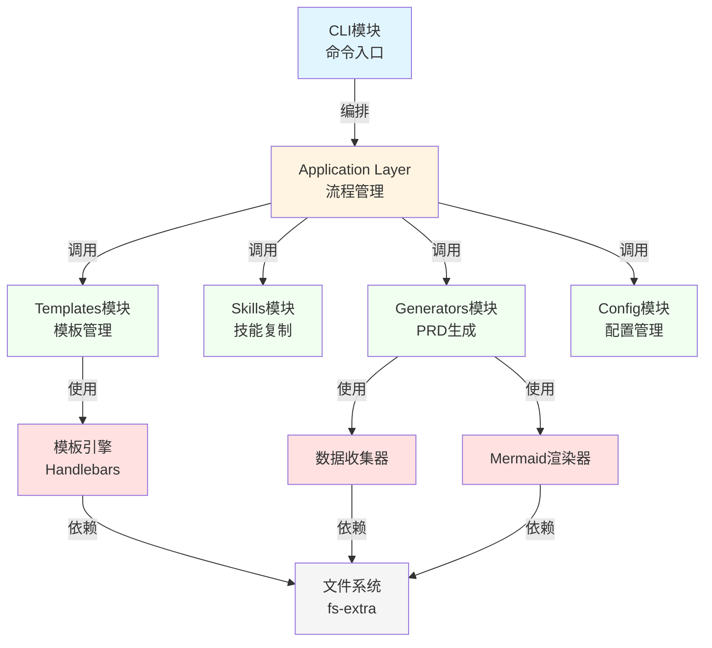
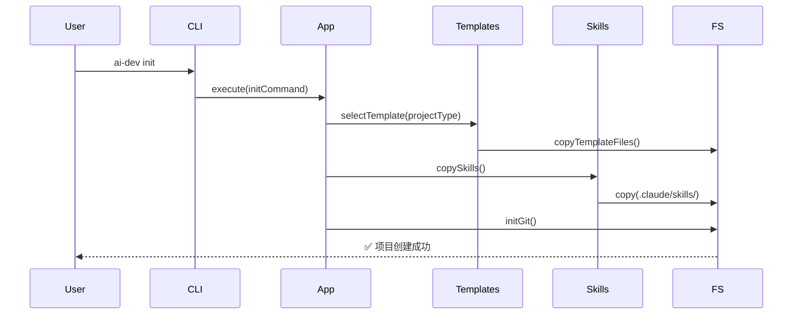
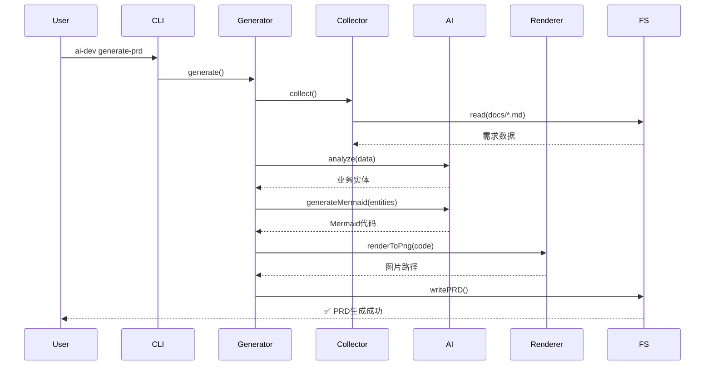

# 架构概览

## 文档信息
- **项目名称**: AI超级个体开发模板系统
- **架构版本**: v1.0
- **创建日期**: 2025-12-10
- **架构师**: Architecture Designer Skill

---

## 1. 架构愿景

### 1.1 设计目标
为**超级个体开发者**（1人团队）提供一套开箱即用的AI辅助开发模板系统，实现：
- **5秒内**完成项目初始化
- **30秒内**生成完整PRD文档
- **零学习成本**的AI工作流集成
- **跨项目复用**的标准化开发流程

### 1.2 核心原则
1. **简单优于复杂**：单一npm包，避免微服务过度设计
2. **性能优先**：CLI启动<100ms，操作响应快速
3. **可维护性**：清晰分层，模块边界明确
4. **扩展性**：支持新项目类型、新模板扩展

---

## 2. 架构风格选择

### 2.1 架构决策：模块化单体架构（Modular Monolith）

**决策理由**：
| 因素 | 分析 | 结论 |
|------|------|------|
| 团队规模 | 1人开发（超级个体） | ✅ 单一代码库最易维护 |
| 性能要求 | CLI启动<100ms，项目创建<5s | ✅ 单体架构无跨进程开销 |
| 用户体验 | npx一条命令安装 | ✅ 单一npm包最简单 |
| 开发效率 | 快速迭代MVP | ✅ 避免微服务复杂度 |

**对比方案**：
- ❌ **微服务架构**：5个独立npm包，维护成本高，用户体验差
- ❌ **插件架构**：过度设计，MVP阶段不需要

### 2.2 架构演进路径
```
当前 (MVP)          未来 (v2.0)          远期 (v3.0)
┌─────────┐        ┌──────────┐        ┌──────────┐
│ Monolith│   →    │ Monorepo │   →    │ Plugins  │
│ 单一包   │        │ 多包管理 │        │ 插件生态 │
└─────────┘        └──────────┘        └──────────┘
```

---

## 3. 分层架构设计

### 3.1 四层架构

```
┌─────────────────────────────────────────────┐
│         CLI Layer (命令行界面层)              │
│  职责: 命令解析、参数验证、用户交互            │
│  技术: Commander.js + Prompts                │
└─────────────────────────────────────────────┘
                    ↓
┌─────────────────────────────────────────────┐
│      Application Layer (应用层)              │
│  职责: 业务流程编排、工作流管理、进度跟踪      │
│  模式: Facade Pattern                        │
└─────────────────────────────────────────────┘
                    ↓
┌─────────────────────────────────────────────┐
│        Domain Layer (领域层)                 │
│  模块: Templates | Skills | Generators | Config │
│  职责: 核心业务逻辑、领域规则                  │
└─────────────────────────────────────────────┘
                    ↓
┌─────────────────────────────────────────────┐
│   Infrastructure Layer (基础设施层)          │
│  职责: 文件系统、Git、模板引擎、Mermaid渲染    │
│  技术: fs-extra, simple-git, Handlebars      │
└─────────────────────────────────────────────┘
```

### 3.2 依赖规则
- **向下依赖**：上层可依赖下层，下层不可依赖上层
- **横向隔离**：同层模块不可直接依赖，通过接口通信
- **依赖注入**：Infrastructure层组件通过DI注入到Domain层

---

## 4. 模块架构

### 4.1 核心模块



### 4.2 模块职责

| 模块 | 职责 | 输入 | 输出 |
|------|------|------|------|
| **CLI** | 用户命令解析、交互式配置 | 命令行参数 | 用户选择 |
| **Templates** | 模板选择、文件生成、目录结构 | 项目类型 | 项目文件 |
| **Skills** | 加载Skills、复制到.claude/目录 | Skills资源 | .claude/skills/ |
| **Generators** | 收集需求、AI分析、PRD生成 | 需求文档 | PRD.md + 图片 |
| **Config** | 项目配置管理、元数据持久化 | 配置对象 | .ai-dev.json |

---

## 5. 技术架构栈

### 5.1 技术选型总览

| 层级 | 技术 | 版本 | 选择理由 |
|------|------|------|---------|
| **开发语言** | TypeScript | 5.x | 类型安全、开发效率 |
| **运行时** | Node.js | >= 14.x | LTS版本、跨平台 |
| **CLI框架** | Commander.js | 11.x | 成熟稳定、API简洁 |
| **交互库** | Prompts | 2.x | 轻量级、现代化 |
| **文件操作** | fs-extra | 11.x | Promise API、易用 |
| **模板引擎** | Handlebars | 4.x | 逻辑分离、简单 |
| **Mermaid渲染** | @mermaid-js/mermaid-cli | 10.x | 官方工具、PNG导出 |
| **Git操作** | simple-git | 3.x | Promise API、功能全 |
| **构建工具** | tsc + esbuild | - | 快速构建 |
| **测试框架** | Vitest | 1.x | 快速、TS原生支持 |

### 5.2 依赖管理策略
- **生产依赖最小化**：只包含必需运行时依赖
- **零外部服务依赖**：离线可用
- **轻量级优先**：总依赖包<50MB

---

## 6. 数据流架构

### 6.1 项目初始化流程



### 6.2 PRD生成流程



---

## 7. 部署架构

### 7.1 分发模式
```
npm Registry
     ↓
@ai-dev-template/cli (单一包)
     ↓
用户执行: npx @ai-dev-template/cli init
     ↓
本地项目目录
```

### 7.2 目录结构
```
@ai-dev-template/cli/
├── bin/
│   └── cli.js              # CLI入口
├── dist/                   # 编译输出
│   ├── cli/
│   ├── templates/
│   ├── skills/
│   ├── generators/
│   └── config/
├── assets/                 # 静态资源
│   ├── templates/          # 模板文件
│   └── skills/             # Skills文件
└── package.json
```

---

## 8. 质量属性

### 8.1 性能指标
| 操作 | 目标 | 测量方法 |
|------|------|---------|
| CLI启动 | < 100ms | 执行时间 |
| 项目初始化 | < 5s | 端到端时间 |
| PRD生成 | < 30s | 完整流程 |
| 单图渲染 | < 5s | Mermaid CLI |

### 8.2 可靠性
- **优雅降级**：Mermaid渲染失败时保留源码
- **错误恢复**：提供清晰错误提示和修复建议
- **幂等性**：重复执行命令安全

### 8.3 可维护性
- **测试覆盖率**: > 80%
- **代码规范**: ESLint + Prettier
- **文档完整性**: 每个模块有README

### 8.4 可扩展性
- **新模板**: 注册新Template对象
- **新命令**: 添加Command实现
- **新Skills**: 放入assets/skills/

---

## 9. 安全考虑

### 9.1 文件系统安全
- **路径验证**: 禁止路径遍历攻击
- **权限检查**: 写入前检查目录权限
- **文件覆盖保护**: 默认不覆盖已存在文件

### 9.2 依赖安全
- **定期审计**: npm audit
- **锁定版本**: package-lock.json
- **最小权限**: 不需要sudo/admin

---

## 10. 架构决策记录（ADR）

### ADR-001: 选择模块化单体架构
- **日期**: 2025-12-10
- **状态**: ✅ 已采纳
- **决策**: 采用单一npm包的模块化单体架构
- **理由**: 1人团队、性能优先、用户体验
- **后果**: 需严格控制模块边界，未来可演进为Monorepo

### ADR-002: TypeScript作为开发语言
- **日期**: 2025-12-10
- **状态**: ✅ 已采纳
- **决策**: 使用TypeScript 5.x开发
- **理由**: 类型安全、开发效率、团队熟悉
- **后果**: 需要编译步骤，但提升长期可维护性

### ADR-003: Mermaid作为图表方案
- **日期**: 2025-12-10
- **状态**: ✅ 已采纳
- **决策**: 使用Mermaid代码嵌入PRD，@mermaid-js/mermaid-cli渲染图片
- **理由**: 纯文本、版本控制友好、易编辑
- **后果**: 依赖Node.js和Puppeteer，包体积较大

---

## 11. 下一步

**架构设计完成后**：
1. ✅ 输出5个架构文档（本文档 + 技术选型 + 模块设计 + 数据模型 + API设计）
2. ⏳ 更新项目进度到50%（架构阶段完成）
3. ⏳ 进入开发阶段（调用developer-guide Skill）

---

**文档版本**: v1.0
**最后更新**: 2025-12-10
**维护者**: Architecture Designer Skill
