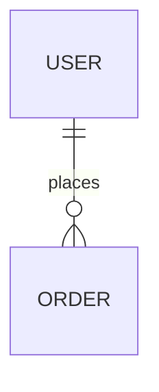

# 技术选型

## 文档信息
- **项目名称**: AI超级个体开发模板系统
- **文档版本**: v1.0
- **创建日期**: 2025-12-10

---

## 1. 技术栈总览

### 1.1 核心技术决策

| 技术领域 | 选型 | 版本 | 必选/可选 |
|---------|------|------|-----------|
| 开发语言 | TypeScript | 5.3+ | 必选 |
| 运行时 | Node.js | >= 14.x | 必选 |
| 包管理器 | npm | 7+ | 必选 |
| CLI框架 | Commander.js | 11.x | 必选 |
| 交互库 | Prompts | 2.x | 必选 |
| 文件操作 | fs-extra | 11.x | 必选 |
| 模板引擎 | Handlebars | 4.x | 必选 |
| Mermaid渲染 | @mermaid-js/mermaid-cli | 10.x | 必选 |
| Git操作 | simple-git | 3.x | 必选 |
| UI增强 | chalk + ora | 5.x / 7.x | 必选 |
| 构建工具 | tsc + esbuild | 5.x / 0.19+ | 必选 |
| 测试框架 | Vitest | 1.x | 必选 |
| 代码质量 | ESLint + Prettier | 8.x / 3.x | 必选 |

---

## 2. 开发语言与运行时

### 2.1 TypeScript 5.x

**选择理由**：
- ✅ **类型安全**：编译时捕获90%的错误
- ✅ **开发效率**：IDE智能提示、自动补全
- ✅ **可维护性**：接口契约明确，重构安全
- ✅ **团队熟悉**：1人团队已掌握

**配置要点**：
```json
{
  "compilerOptions": {
    "target": "ES2020",
    "module": "commonjs",
    "lib": ["ES2020"],
    "outDir": "./dist",
    "rootDir": "./src",
    "strict": true,
    "esModuleInterop": true,
    "skipLibCheck": true,
    "forceConsistentCasingInFileNames": true,
    "resolveJsonModule": true,
    "declaration": true
  }
}
```

### 2.2 Node.js >= 14.x

**版本选择**：
- **最低支持**: Node.js 14.x（LTS）
- **推荐版本**: Node.js 18.x+（Active LTS）
- **测试覆盖**: 14.x, 16.x, 18.x, 20.x

**选择理由**：
- ✅ **跨平台**：Windows、macOS、Linux原生支持
- ✅ **生态成熟**：npm生态丰富
- ✅ **性能优秀**：V8引擎优化
- ✅ **兼容性**：覆盖95%+用户

**依赖特性**：
- fs.promises API（Node 14+）
- import.meta.url（Node 14.8+）
- AbortController（Node 15+，polyfill支持）

---

## 3. CLI框架与交互

### 3.1 Commander.js 11.x

**选择理由**：
- ✅ **成熟稳定**：npm周下载量3000万+
- ✅ **API简洁**：声明式命令定义
- ✅ **功能完整**：子命令、选项、帮助文档
- ✅ **TypeScript支持**：官方类型定义

**对比方案**：
| 框架 | 优势 | 劣势 | 结论 |
|------|------|------|------|
| Commander.js | 简洁、成熟 | 无 | ✅ 选择 |
| Yargs | 功能丰富 | API复杂 | ❌ 过度 |
| CAC | 轻量 | 生态小 | ❌ 风险 |

**使用示例**：
```typescript
import { Command } from 'commander';

const program = new Command();

program
  .name('ai-dev')
  .version('1.0.0')
  .description('AI超级个体开发模板CLI');

program
  .command('init [project-name]')
  .description('初始化新项目')
  .option('-t, --type <type>', '项目类型')
  .option('--no-git', '跳过git初始化')
  .action(initCommand);
```

### 3.2 Prompts 2.x

**选择理由**：
- ✅ **轻量级**：<10KB，无重依赖
- ✅ **现代化**：async/await API
- ✅ **美观**：交互界面简洁
- ✅ **TypeScript**：完整类型支持

**对比方案**：
| 库 | 包大小 | API风格 | 结论 |
|----|--------|---------|------|
| Prompts | 9KB | 现代 | ✅ 选择 |
| Inquirer | 1.2MB | 传统 | ❌ 太重 |
| Enquirer | 50KB | 现代 | ⚠️ 备选 |

**使用示例**：
```typescript
import prompts from 'prompts';

const response = await prompts([
  {
    type: 'select',
    name: 'projectType',
    message: '选择项目类型',
    choices: [
      { title: 'Web全栈应用', value: 'web-fullstack' },
      { title: '移动应用', value: 'mobile-app' },
      { title: '后端API', value: 'backend-api' },
      { title: 'CLI工具', value: 'cli-tool' }
    ]
  },
  {
    type: 'text',
    name: 'projectName',
    message: '项目名称',
    initial: 'my-app'
  }
]);
```

---

## 4. 文件系统与Git

### 4.1 fs-extra 11.x

**选择理由**：
- ✅ **Promise API**：async/await友好
- ✅ **功能增强**：copy、ensureDir等高级方法
- ✅ **向后兼容**：完全兼容原生fs
- ✅ **跨平台**：路径处理自动适配

**核心方法**：
```typescript
import fs from 'fs-extra';

// 确保目录存在
await fs.ensureDir('/path/to/dir');

// 递归复制
await fs.copy('/src', '/dest', { overwrite: false });

// 读写JSON
const data = await fs.readJson('/config.json');
await fs.writeJson('/config.json', data, { spaces: 2 });

// 移动文件
await fs.move('/old', '/new');
```

### 4.2 simple-git 3.x

**选择理由**：
- ✅ **Promise API**：完全异步
- ✅ **功能完整**：支持99%的git操作
- ✅ **错误处理**：友好的错误信息
- ✅ **跨平台**：自动检测git路径

**使用示例**：
```typescript
import simpleGit from 'simple-git';

const git = simpleGit('/project/path');

// 初始化仓库
await git.init();

// 添加文件
await git.add('./*');

// 提交
await git.commit('Initial commit from ai-dev template');

// 检查状态
const status = await git.status();
```

---

## 5. 模板引擎

### 5.1 Handlebars 4.x

**选择理由**：
- ✅ **逻辑分离**：模板不含复杂逻辑
- ✅ **简单易用**：学习成本低
- ✅ **性能优秀**：预编译模板
- ✅ **生态成熟**：大量helper库

**对比方案**：
| 引擎 | 逻辑分离 | 性能 | 生态 | 结论 |
|------|---------|------|------|------|
| Handlebars | ✅ | 优秀 | 成熟 | ✅ 选择 |
| EJS | ❌ | 良好 | 成熟 | ❌ 逻辑混乱 |
| Mustache | ✅ | 优秀 | 小众 | ⚠️ 功能弱 |

**使用示例**：
```typescript
import Handlebars from 'handlebars';

const template = Handlebars.compile(`
# {{projectName}}

> {{description}}

## 技术栈
{{#each techStack}}
- {{this}}
{{/each}}
`);

const output = template({
  projectName: 'My App',
  description: 'A great project',
  techStack: ['TypeScript', 'Node.js', 'React']
});
```

---

## 6. Mermaid图表渲染

### 6.1 @mermaid-js/mermaid-cli 10.x

**选择理由**：
- ✅ **官方工具**：Mermaid官方维护
- ✅ **功能完整**：支持所有图表类型
- ✅ **PNG导出**：高质量图片
- ✅ **CLI友好**：命令行调用

**依赖说明**：
- 底层依赖：Puppeteer（无头浏览器）
- 包大小：~150MB（含Chromium）
- 安装时间：首次较慢（下载Chromium）

**对比方案**：
| 方案 | 优势 | 劣势 | 结论 |
|------|------|------|------|
| mermaid-cli | 官方、功能全 | 包大 | ✅ 选择 |
| mermaid-isomorphic | 轻量 | 功能弱 | ❌ 不支持PNG |
| 在线API | 无依赖 | 需联网 | ❌ 不符合离线要求 |

**使用示例**：
```typescript
import { run } from '@mermaid-js/mermaid-cli';

// 渲染Mermaid为PNG
await run(
  'input.mmd',          // Mermaid源文件
  'output.png',         // 输出图片
  {
    backgroundColor: 'transparent',
    width: 1200,
    height: 800
  }
);
```

**降级方案**：
如果渲染失败，保留Mermaid源码在PRD中：
```markdown
<details>
<summary>📄 查看 Mermaid 源码</summary>


</details>
```

---

## 7. UI增强库

### 7.1 chalk 5.x

**选择理由**：
- ✅ **彩色输出**：提升CLI可读性
- ✅ **轻量级**：<5KB
- ✅ **链式API**：易用

**使用示例**：
```typescript
import chalk from 'chalk';

console.log(chalk.green('✅ 项目创建成功！'));
console.log(chalk.yellow('⚠️  警告：跳过了原型设计'));
console.log(chalk.red('❌ 错误：需求文档缺失'));
console.log(chalk.blue.bold('📖 下一步：运行 ai-dev generate-prd'));
```

### 7.2 ora 7.x

**选择理由**：
- ✅ **加载动画**：优化等待体验
- ✅ **状态管理**：成功/失败/警告
- ✅ **多spinner**：并行任务

**使用示例**：
```typescript
import ora from 'ora';

const spinner = ora('正在渲染图表...').start();

try {
  await renderDiagrams();
  spinner.succeed('✅ 图表渲染完成');
} catch (error) {
  spinner.fail('❌ 渲染失败');
}
```

---

## 8. 构建与测试

### 8.1 构建工具：tsc + esbuild

**TypeScript编译器（tsc）**：
- 职责：类型检查、生成.d.ts声明文件
- 配置：`tsc --noEmit`（仅检查）

**esbuild**：
- 职责：快速打包、压缩
- 配置：`esbuild src/index.ts --bundle --platform=node --outfile=dist/index.js`

**构建流程**：
```bash
# 1. 类型检查
tsc --noEmit

# 2. 打包
esbuild src/cli/index.ts --bundle --platform=node --outfile=dist/cli.js

# 3. 复制资源
cp -r assets/ dist/assets/
```

### 8.2 测试框架：Vitest 1.x

**选择理由**：
- ✅ **速度快**：Vite驱动，HMR支持
- ✅ **TypeScript原生**：无需配置
- ✅ **兼容Jest**：API一致，迁移成本低
- ✅ **覆盖率**：内置c8覆盖率工具

**测试策略**：
```typescript
import { describe, it, expect } from 'vitest';
import { TemplateRegistry } from '@/templates';

describe('TemplateRegistry', () => {
  it('should return all templates', () => {
    const registry = new TemplateRegistry();
    const templates = registry.getAll();
    expect(templates).toHaveLength(4);
  });

  it('should get template by type', () => {
    const registry = new TemplateRegistry();
    const template = registry.getByType('web-fullstack');
    expect(template).toBeDefined();
    expect(template?.name).toBe('Web全栈应用');
  });
});
```

**测试目标**：
- 单元测试覆盖率 > 80%
- 集成测试：关键流程（init、generate-prd）
- E2E测试：完整用户场景

---

## 9. 代码质量工具

### 9.1 ESLint 8.x

**配置**：
```json
{
  "extends": [
    "eslint:recommended",
    "plugin:@typescript-eslint/recommended"
  ],
  "parser": "@typescript-eslint/parser",
  "plugins": ["@typescript-eslint"],
  "rules": {
    "no-console": "warn",
    "@typescript-eslint/no-explicit-any": "error",
    "@typescript-eslint/explicit-function-return-type": "warn"
  }
}
```

### 9.2 Prettier 3.x

**配置**：
```json
{
  "semi": true,
  "singleQuote": true,
  "tabWidth": 2,
  "trailingComma": "es5",
  "printWidth": 80
}
```

---

## 10. 依赖包清单

### 10.1 生产依赖（dependencies）

```json
{
  "dependencies": {
    "commander": "^11.1.0",
    "prompts": "^2.4.2",
    "fs-extra": "^11.2.0",
    "handlebars": "^4.7.8",
    "@mermaid-js/mermaid-cli": "^10.6.1",
    "simple-git": "^3.21.0",
    "chalk": "^5.3.0",
    "ora": "^7.0.1"
  }
}
```

**总大小估算**：~180MB（含Puppeteer/Chromium）

### 10.2 开发依赖（devDependencies）

```json
{
  "devDependencies": {
    "typescript": "^5.3.3",
    "esbuild": "^0.19.11",
    "vitest": "^1.1.0",
    "@types/node": "^20.10.6",
    "@types/prompts": "^2.4.9",
    "@types/fs-extra": "^11.0.4",
    "@typescript-eslint/eslint-plugin": "^6.17.0",
    "@typescript-eslint/parser": "^6.17.0",
    "eslint": "^8.56.0",
    "prettier": "^3.1.1"
  }
}
```

---

## 11. 兼容性矩阵

### 11.1 Node.js版本

| 版本 | 支持状态 | 测试覆盖 | 备注 |
|------|---------|---------|------|
| 14.x | ✅ 支持 | ✅ CI测试 | 最低版本 |
| 16.x | ✅ 支持 | ✅ CI测试 | LTS |
| 18.x | ✅ 支持 | ✅ CI测试 | Active LTS |
| 20.x | ✅ 支持 | ✅ CI测试 | 推荐 |

### 11.2 操作系统

| 平台 | 支持状态 | 测试覆盖 |
|------|---------|---------|
| Windows 10+ | ✅ 支持 | ✅ CI测试 |
| macOS 11+ | ✅ 支持 | ✅ CI测试 |
| Linux (Ubuntu 20.04+) | ✅ 支持 | ✅ CI测试 |

---

## 12. 性能优化策略

### 12.1 CLI启动优化
- **延迟加载**：按需require模块
- **缓存预热**：首次运行生成缓存
- **精简依赖**：避免大型依赖（如lodash全量）

### 12.2 文件操作优化
- **流式处理**：大文件使用stream
- **并行复制**：Promise.all批量操作
- **增量更新**：仅复制变更文件

### 12.3 Mermaid渲染优化
- **批量渲染**：多图表并行处理
- **缓存结果**：相同代码复用图片
- **超时控制**：单图最大5秒

---

## 13. 安全考虑

### 13.1 依赖安全
- **定期审计**：`npm audit` 每周执行
- **自动更新**：Dependabot监控漏洞
- **锁定版本**：使用package-lock.json

### 13.2 代码安全
- **路径验证**：防止路径遍历
- **输入清理**：用户输入sanitize
- **文件权限**：最小权限原则

---

## 14. 未来技术演进

### 14.1 短期（v1.0 - v1.5）
- 优化Mermaid渲染性能
- 支持自定义模板扩展
- 添加插件系统基础

### 14.2 中期（v2.0）
- 演进为Monorepo架构
- 支持在线模板仓库
- AI模型本地化（离线运行）

### 14.3 长期（v3.0+）
- 插件生态系统
- GUI工具支持
- 多语言支持

---

**文档版本**: v1.0
**最后更新**: 2025-12-10
**维护者**: Architecture Designer Skill
