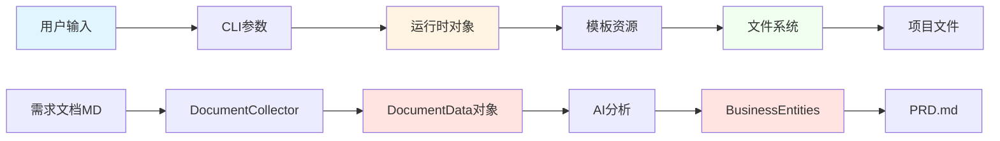
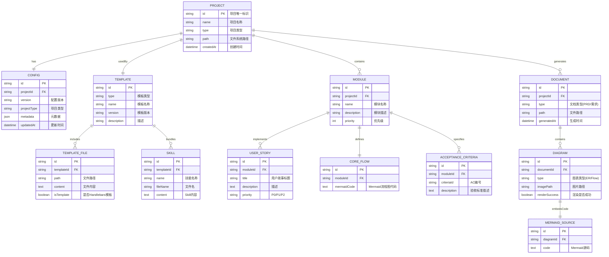

# 数据模型

## 文档信息
- **项目名称**: AI超级个体开发模板系统
- **文档版本**: v1.0
- **创建日期**: 2025-12-10

---

## 1. 数据模型概览

### 1.1 实体分类

本系统作为CLI工具，数据主要以**文件系统**形式存储，分为以下几类：

| 实体类别 | 存储方式 | 持久化 | 示例 |
|---------|---------|-------|------|
| **项目实体** | 文件系统 | 是 | Project、Config |
| **模板实体** | 内存 + 资源文件 | 否 | Template、TemplateFile |
| **文档实体** | Markdown文件 | 是 | PRD、需求文档 |
| **元数据实体** | JSON文件 | 是 | .ai-dev.json |
| **运行时实体** | 内存 | 否 | WorkflowState、Progress |

### 1.2 数据流向



---

## 2. 核心实体关系图（ER图）



---

## 3. 实体详细定义

### 3.1 Project（项目）

**说明**：表示一个使用ai-dev创建的项目。

**字段**：
```typescript
interface Project {
  id: string;                    // UUID
  name: string;                  // 项目名称（目录名）
  type: ProjectType;             // 项目类型
  path: string;                  // 绝对路径
  createdAt: Date;               // 创建时间
  config?: ProjectConfig;        // 关联的配置
}

type ProjectType =
  | 'web-fullstack'
  | 'mobile-app'
  | 'backend-api'
  | 'cli-tool';
```

**存储位置**：文件系统目录，元数据在`.ai-dev.json`

**约束**：
- name必须符合npm命名规范（小写、连字符）
- path必须是有效的文件系统路径
- type必须是4种预定义类型之一

---

### 3.2 Config（项目配置）

**说明**：项目的元数据配置，存储在`.ai-dev.json`文件。

**字段**：
```typescript
interface ProjectConfig {
  version: string;               // 配置文件版本（如 "1.0.0"）
  projectType: ProjectType;      // 项目类型
  projectName: string;           // 项目名称
  description: string;           // 项目描述
  author: string;                // 作者
  createdAt: Date;               // 创建时间
  updatedAt?: Date;              // 最后更新时间
  metadata: ConfigMetadata;      // 扩展元数据
}

interface ConfigMetadata {
  templateVersion: string;       // 使用的模板版本
  claudeVersion: string;         // Claude Code版本
  skills: string[];              // 包含的Skills列表
  customSettings?: Record<string, any>;  // 自定义配置
}
```

**存储格式**：JSON
```json
{
  "version": "1.0.0",
  "projectType": "web-fullstack",
  "projectName": "my-app",
  "description": "A great web application",
  "author": "John Doe",
  "createdAt": "2025-12-10T08:00:00.000Z",
  "metadata": {
    "templateVersion": "1.0.0",
    "claudeVersion": "4.5",
    "skills": [
      "requirements-analyzer",
      "architecture-designer",
      "developer-guide",
      "test-planner"
    ]
  }
}
```

**约束**：
- version必须符合SemVer规范
- projectType必须有效
- skills数组至少包含4个默认Skills

---

### 3.3 Template（模板）

**说明**：项目模板定义，包含文件结构和内容。

**字段**：
```typescript
interface Template {
  id: string;                    // 模板ID（如 "web-fullstack"）
  type: ProjectType;             // 对应的项目类型
  name: string;                  // 显示名称
  version: string;               // 模板版本
  description: string;           // 描述
  files: TemplateFile[];         // 模板文件列表
  directories: string[];         // 目录结构
  scripts: PackageScripts;       // package.json中的scripts
}

interface TemplateFile {
  path: string;                  // 相对路径（如 "src/index.ts"）
  content: string | TemplateContent;
  encoding: BufferEncoding;      // 文件编码（默认utf8）
  isTemplate: boolean;           // 是否需要Handlebars渲染
}

interface TemplateContent {
  template: string;              // Handlebars模板字符串
  data: Record<string, any>;     // 模板数据
}

type PackageScripts = Record<string, string>;
```

**存储位置**：
- 代码：`src/templates/registry/templates/`
- 资源：`assets/templates/`

**约束**：
- id必须唯一
- 每个ProjectType只能有一个Template

---

### 3.4 Skill（技能）

**说明**：Claude Code的Skill文件。

**字段**：
```typescript
interface Skill {
  id: string;                    // Skill ID
  name: string;                  // Skill名称
  fileName: string;              // 文件名（如 "requirements-analyzer.md"）
  content: string;               // Markdown内容
  description: string;           // 简短描述
}
```

**存储位置**：`assets/skills/`

**固定Skills**：
1. requirements-analyzer.md
2. architecture-designer.md
3. developer-guide.md
4. test-planner.md

**约束**：
- fileName必须以`.md`结尾
- content必须是有效的Markdown

---

### 3.5 Module（模块）

**说明**：项目的功能模块。

**字段**：
```typescript
interface Module {
  id: string;                    // 模块ID
  projectId: string;             // 所属项目ID
  name: string;                  // 模块名称
  description: string;           // 模块描述
  priority: number;              // 优先级（0-2，对应P0-P2）
  userStories: UserStory[];      // 用户故事
  coreFlow?: CoreFlow;           // 核心流程
  acceptanceCriteria: AcceptanceCriteria[];  // 验收标准
}
```

**存储位置**：`docs/modules/{模块名}/`

**约束**：
- name在同一项目内唯一
- 至少包含1个用户故事

---

### 3.6 Document（文档）

**说明**：生成的文档实体（如PRD、需求文档）。

**字段**：
```typescript
interface Document {
  id: string;                    // 文档ID
  projectId: string;             // 所属项目ID
  type: DocumentType;            // 文档类型
  title: string;                 // 文档标题
  path: string;                  // 文件路径
  content: string;               // Markdown内容
  generatedAt: Date;             // 生成时间
  diagrams: Diagram[];           // 包含的图表
}

type DocumentType =
  | 'PRD'                        // 产品需求文档
  | 'requirement'                // 需求文档
  | 'architecture'               // 架构文档
  | 'test-plan';                 // 测试计划
```

**存储位置**：`docs/` 或 `docs/PRD/`

---

### 3.7 Diagram（图表）

**说明**：文档中的图表（ER图、流程图等）。

**字段**：
```typescript
interface Diagram {
  id: string;                    // 图表ID
  documentId: string;            // 所属文档ID
  type: DiagramType;             // 图表类型
  imagePath: string;             // PNG图片路径
  mermaidSource: MermaidSource;  // Mermaid源码
  renderSuccess: boolean;        // 渲染是否成功
  error?: string;                // 渲染错误信息
}

type DiagramType =
  | 'entity-relationship'        // 实体关系图
  | 'flow'                       // 流程图
  | 'sequence'                   // 时序图
  | 'class';                     // 类图

interface MermaidSource {
  id: string;
  diagramId: string;
  code: string;                  // Mermaid代码
}
```

**存储位置**：
- 图片：`docs/PRD/assets/images/`
- Mermaid代码：嵌入在文档的`<details>`标签中

**约束**：
- imagePath如果存在必须指向有效的PNG文件
- mermaidSource.code必须是有效的Mermaid语法

---

## 4. 业务模型对象

### 4.1 DocumentData（文档数据）

**说明**：PRD生成时收集的需求数据。

```typescript
interface DocumentData {
  projectOverview: ProjectOverview;
  moduleDivision: ModuleDivision;
  userStories: UserStory[];
  modules: ModuleDetail[];
}

interface ProjectOverview {
  name: string;
  vision: string;
  targetUsers: string;
  coreValue: string;
  competitiveAnalysis: string;
}

interface ModuleDivision {
  modules: ModuleInfo[];
  relationships: string;         // Mermaid代码
}

interface ModuleInfo {
  name: string;
  description: string;
  priority: 'P0' | 'P1' | 'P2';
}

interface ModuleDetail {
  name: string;
  coreFlow: string;              // Markdown内容
  acceptanceCriteria: string;    // Markdown内容
  prototype?: string;            // Markdown内容（可选）
}
```

---

### 4.2 BusinessEntities（业务实体）

**说明**：AI分析出的业务实体模型。

```typescript
interface BusinessEntities {
  entities: BusinessEntity[];
  relationships: EntityRelationship[];
}

interface BusinessEntity {
  name: string;                  // 实体名称（如 "USER"）
  displayName: string;           // 显示名称（如 "用户"）
  attributes: EntityAttribute[];
  description?: string;
}

interface EntityAttribute {
  name: string;                  // 属性名（如 "id"）
  type: string;                  // 数据类型（如 "uuid"）
  constraints: string[];         // 约束（如 ["PK", "NOT NULL"]）
  description?: string;
}

interface EntityRelationship {
  from: string;                  // 源实体名
  to: string;                    // 目标实体名
  type: '1:1' | '1:N' | 'N:M';  // 关系类型
  description: string;           // 关系描述
}
```

---

## 5. 运行时对象

### 5.1 WorkflowState（工作流状态）

```typescript
interface WorkflowState {
  currentStep: string;
  totalSteps: number;
  completedSteps: string[];
  errors: WorkflowError[];
  startTime: Date;
}

interface WorkflowError {
  step: string;
  message: string;
  timestamp: Date;
}
```

### 5.2 CommandResult（命令结果）

```typescript
interface CommandResult<T = any> {
  success: boolean;
  message?: string;
  data?: T;
  error?: Error;
  duration?: number;
}
```

---

## 6. 文件系统映射

### 6.1 项目目录结构

```
my-app/                          # Project实体
├── .ai-dev.json                 # Config实体
├── CLAUDE.md                    # Claude工作流配置
├── .claude/
│   └── skills/                  # Skill实体（4个文件）
│       ├── requirements-analyzer.md
│       ├── architecture-designer.md
│       ├── developer-guide.md
│       └── test-planner.md
├── docs/
│   ├── 00-项目概览.md            # Document实体
│   ├── 01-模块划分.md
│   ├── 02-用户故事.md
│   ├── modules/                 # Module实体
│   │   ├── 模块A/
│   │   │   ├── 03-核心流程.md
│   │   │   ├── 04-原型设计.md
│   │   │   └── 05-验收标准.md
│   │   └── 模块B/
│   │       └── ...
│   └── PRD/                     # Document实体
│       ├── PRD.md
│       ├── README.md
│       └── assets/
│           └── images/          # Diagram实体（PNG）
│               ├── business-entity-diagram.png
│               └── flow-xxx.png
├── src/                         # 代码文件（由Template生成）
├── package.json
└── ...
```

### 6.2 数据持久化策略

| 实体 | 持久化方式 | 文件格式 | 读取时机 | 写入时机 |
|------|-----------|---------|---------|---------|
| Project | 文件系统目录 | - | 命令执行时 | `ai-dev init` |
| Config | JSON文件 | .ai-dev.json | 命令执行时 | `ai-dev init` |
| Template | 内存 + 资源文件 | TypeScript代码 + 静态文件 | 程序启动时 | 无（只读） |
| Skill | Markdown文件 | .md | 程序启动时 | `ai-dev init`时复制 |
| Module | Markdown文件 | 03/04/05.md | `generate-prd`时 | 用户手动创建 |
| Document | Markdown文件 | .md | 按需 | `generate-prd` |
| Diagram | PNG图片 | .png | 按需 | `generate-prd` |
| MermaidSource | 嵌入在Markdown | `<details>`标签 | 解析Markdown | `generate-prd` |

---

## 7. 数据验证规则

### 7.1 Config验证

```typescript
const configSchema = {
  version: {
    type: 'string',
    pattern: /^\d+\.\d+\.\d+$/,   // SemVer
    required: true
  },
  projectType: {
    type: 'string',
    enum: ['web-fullstack', 'mobile-app', 'backend-api', 'cli-tool'],
    required: true
  },
  projectName: {
    type: 'string',
    pattern: /^[a-z0-9-]+$/,      // npm命名规范
    required: true
  },
  metadata: {
    type: 'object',
    properties: {
      skills: {
        type: 'array',
        minItems: 4
      }
    }
  }
};
```

### 7.2 Template验证

```typescript
const templateSchema = {
  id: { type: 'string', required: true, unique: true },
  type: { type: 'string', enum: ProjectType[], required: true },
  files: {
    type: 'array',
    minItems: 1,
    items: {
      path: { type: 'string', required: true },
      content: { type: 'string', required: true }
    }
  }
};
```

---

## 8. 数据迁移策略

### 8.1 版本兼容性

当`.ai-dev.json`的`version`字段变更时：

| 版本变更 | 策略 |
|---------|------|
| 1.0.0 → 1.x.x | 向后兼容，自动迁移 |
| 1.x.x → 2.0.0 | 提示用户手动迁移 |

### 8.2 迁移脚本示例

```typescript
class ConfigMigrator {
  migrate(oldConfig: any, targetVersion: string): ProjectConfig {
    if (oldConfig.version.startsWith('1.0')) {
      // 1.0.x → 1.1.x 迁移
      return {
        ...oldConfig,
        version: '1.1.0',
        metadata: {
          ...oldConfig.metadata,
          // 新增字段
          generatedPRDCount: 0
        }
      };
    }
    throw new Error(`不支持从 ${oldConfig.version} 迁移`);
  }
}
```

---

## 9. 性能优化

### 9.1 数据加载优化
- **延迟加载**：只在需要时读取文件
- **缓存**：Template和Skill加载后缓存在内存
- **流式处理**：大文件使用stream读取

### 9.2 数据写入优化
- **批量写入**：多个文件批量操作
- **异步IO**：使用Promise.all并行写入
- **原子操作**：写入临时文件后rename

---

## 10. 数据安全

### 10.1 敏感数据保护
- 不存储用户密码或API密钥
- `.ai-dev.json`可以提交到Git（无敏感信息）

### 10.2 文件权限
- 创建的文件默认权限：644
- 创建的目录默认权限：755

---

**文档版本**: v1.0
**最后更新**: 2025-12-10
**维护者**: Architecture Designer Skill
