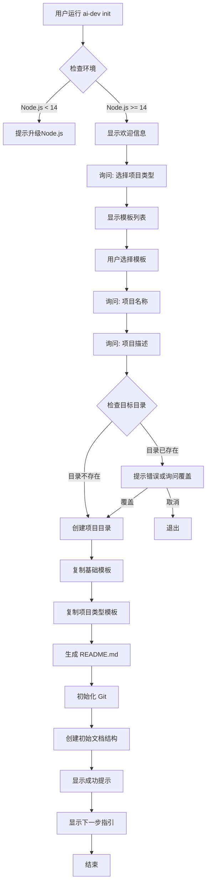
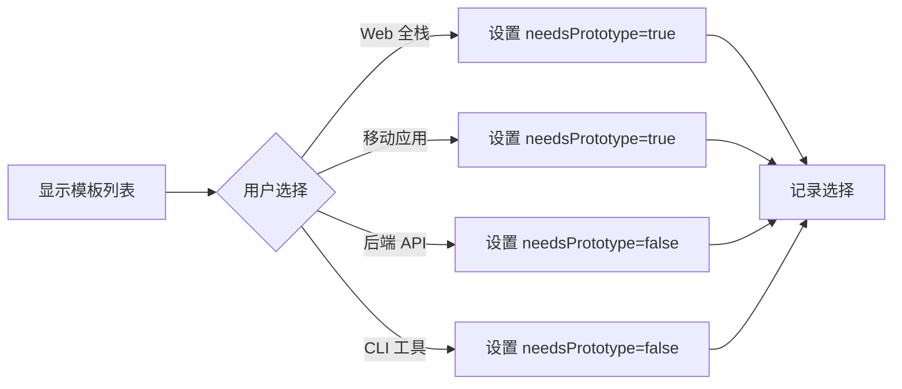
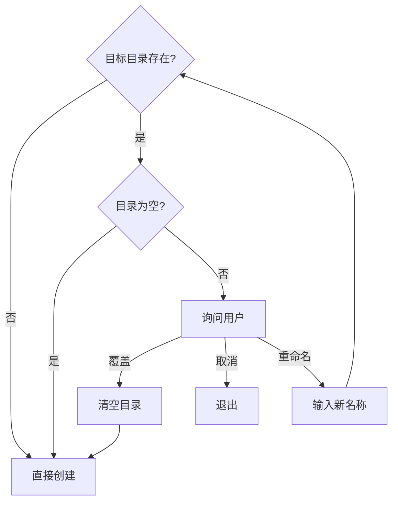
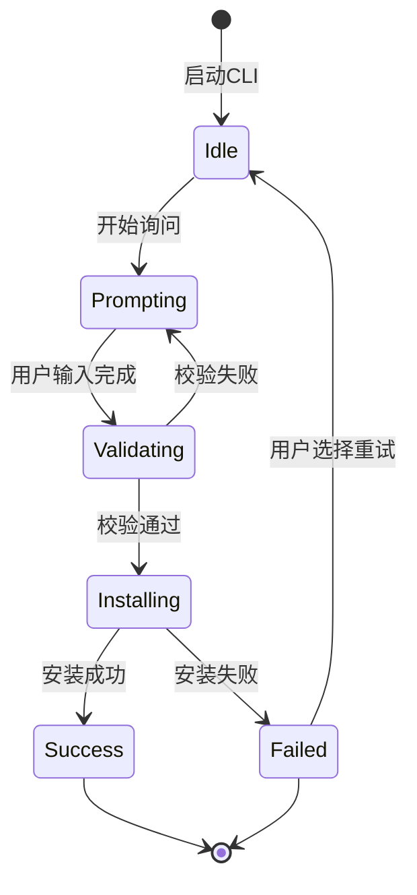

# CLI工具模块 核心流程

## 主流程: 初始化项目 (ai-dev init)



## 子流程1: 模板选择



## 子流程2: 目录冲突处理



## 异常流程

| 异常场景 | 触发条件 | 系统行为 | 用户感知 |
|---------|---------|---------|---------|
| Node.js版本过低 | node --version < 14 | 阻止执行 | 红色错误提示 + 升级指引 |
| 网络连接失败 | npm registry 不可达 | 降级到离线模式 | 警告提示，使用本地模板 |
| 磁盘空间不足 | 剩余空间 < 100MB | 阻止执行 | 红色错误提示 |
| 权限不足 | 无法写入目标目录 | 阻止执行 | 权限错误提示 + 解决方案 |
| 模板损坏 | 模板文件缺失 | 重新下载或报错 | 错误提示 + 重试选项 |

## 业务规则

### BR-001: 项目命名规则
- **规则**: 项目名称必须符合 npm 包命名规范
- **格式**: 小写字母、数字、连字符、下划线
- **长度**: 1-214个字符
- **校验**: 使用 `validate-npm-package-name` 库

### BR-002: 目录结构规则
```
{project-name}/
├── .claude/
│   ├── skills/
│   └── settings.json
├── CLAUDE.md
├── docs/
│   ├── modules/
│   ├── architecture/
│   └── trackers/
├── README.md
└── .gitignore
```

### BR-003: Git初始化规则
- 自动 `git init`
- 自动创建 `.gitignore`
- 不自动创建首次提交（留给用户决定）

### BR-004: 模板合并规则
1. 先复制基础模板（完整复制）
2. 再复制项目类型模板（覆盖同名文件）
3. 保留项目类型模板的特殊配置

## 状态机



## 性能要求

| 操作 | 性能目标 | 测量方法 |
|------|---------|---------|
| 显示模板列表 | < 100ms | 从启动到显示 |
| 复制基础模板 | < 2秒 | 文件复制耗时 |
| 完整项目创建 | < 5秒 | 从确认到成功提示 |
| 内存占用 | < 100MB | 运行时内存峰值 |

## 用户体验细节

### 交互设计
- ✅ 使用颜色区分不同类型的提示（成功=绿色、错误=红色、警告=黄色）
- ✅ 显示进度指示器（Spinner）
- ✅ 关键步骤显示 ✓ 标记
- ✅ 提供清晰的下一步指引

### 错误提示格式
```
❌ 错误: {错误描述}

原因: {具体原因}

解决方案:
  1. {解决步骤1}
  2. {解决步骤2}

更多帮助: https://github.com/xxx/issues
```

---

**文档版本**: v1.0
**创建日期**: 2025-12-10
