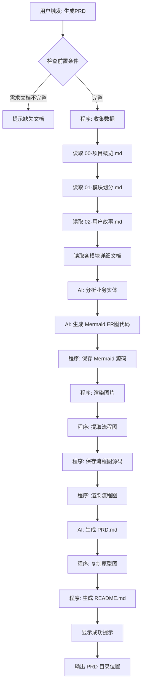
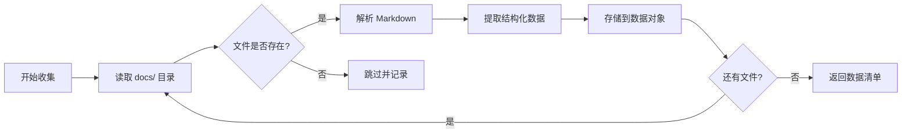
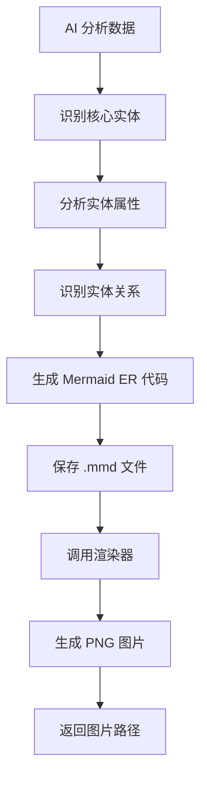
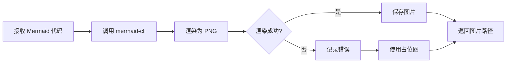
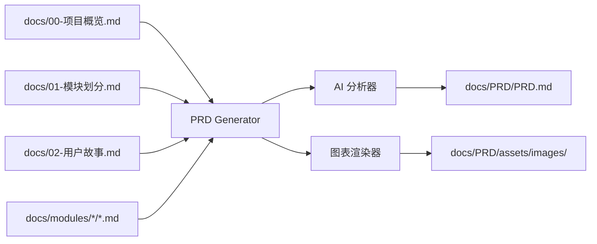

# 文档生成模块 核心流程

## 主流程: PRD 生成 (ai-dev generate-prd 或 Claude 中输入"生成PRD")



## 子流程1: 数据收集 (Collector)



## 子流程2: 业务实体关系图生成



**AI 实体识别策略**：
1. 从 `05-验收标准.md` 中提取数据字段
2. 从 `03-核心流程.md` 中提取业务对象
3. 从 `04-原型设计.md` 中提取页面数据
4. 合并去重，识别核心实体
5. 推断实体间关系（1:1, 1:N, N:M）

## 子流程3: Mermaid 图表渲染



## 异常流程

| 异常场景 | 触发条件 | 系统行为 | 用户感知 |
|---------|---------|---------|---------|
| 需求文档缺失 | 00/01/02 文档不存在 | 阻止生成 | 错误提示 + 缺失清单 |
| 模块文档不完整 | 缺少 03/05 文档 | 警告但继续 | 警告提示 + 跳过该模块 |
| Mermaid 渲染失败 | 语法错误 | 使用文本代码 | 警告提示 + 保留源码 |
| AI 调用失败 | API 错误 | 使用模板内容 | 错误提示 + 降级方案 |
| 磁盘空间不足 | 无法写入 | 阻止生成 | 错误提示 + 清理建议 |

## 业务规则

### BR-101: PRD 目录结构规则
```
docs/PRD/
├── PRD.md                    # 主文档（包含嵌入的 Mermaid 代码）
├── README.md                 # 使用说明
└── assets/
    └── images/              # 渲染后的图片
```

### BR-102: 图表命名规则
| 图表类型 | 命名格式 | 示例 |
|---------|---------|------|
| 业务实体图 | `business-entity-diagram` | business-entity-diagram.png |
| 模块关系图 | `module-relationship-{N}` | module-relationship-0.png |
| 业务流程图 | `flow-{模块名}-{N}` | flow-order-0.png |

### BR-103: 图片格式规则
- **格式**: PNG
- **分辨率**: 1200px 宽度
- **背景**: 透明或白色
- **文字**: 清晰可读（最小12px）

### BR-104: Mermaid 代码嵌入规则
- 所有 Mermaid 代码直接嵌入 PRD.md 中
- 使用 `<details>` 标签折叠代码块
- 代码块紧跟在对应图片后面
- 保持代码格式清晰易读

## 数据流



## 性能要求

| 操作 | 性能目标 | 测量方法 |
|------|---------|---------|
| 数据收集 | < 1秒 | 文件读取耗时 |
| AI 分析 | < 10秒 | API 调用耗时 |
| 图表渲染 | < 5秒/图 | Mermaid CLI 耗时 |
| 完整 PRD 生成 | < 30秒 | 端到端耗时 |
| 内存占用 | < 200MB | 峰值内存 |

## 用户体验细节

### 进度提示
```
🔍 正在收集需求文档...
✓ 已收集 5 个文档

🤖 AI 正在分析业务实体...
✓ 识别到 5 个核心实体

🎨 正在渲染图表...
  ✓ 业务实体关系图 (1/5)
  ✓ 模块关系图 (2/5)
  ✓ 订单流程图 (3/5)
  ✓ 支付流程图 (4/5)
  ✓ 用户流程图 (5/5)

📝 正在生成 PRD.md...
  ✓ 嵌入 Mermaid 代码
  ✓ 关联图片引用
✓ PRD 生成完成！

📁 输出位置: docs/PRD/
📄 主文档: docs/PRD/PRD.md
🖼️  图片资源: docs/PRD/assets/images/ (5张图片)
```

### 成功提示格式
```
🎉 PRD 生成成功！

📦 生成的文件:
  - PRD.md (完整产品需求文档，包含嵌入的 Mermaid 代码)
  - assets/images/ (5 张图片)
  - README.md (使用说明)

📖 下一步:
  1. 查看 PRD: code docs/PRD/PRD.md
  2. 分享团队: zip -r PRD.zip docs/PRD/
  3. 导出 PDF: npx md-to-pdf docs/PRD/PRD.md

💡 提示: Mermaid 代码直接嵌入在 PRD 中，可以复制到 https://mermaid.live 编辑
```

---

**文档版本**: v1.0
**创建日期**: 2025-12-10
