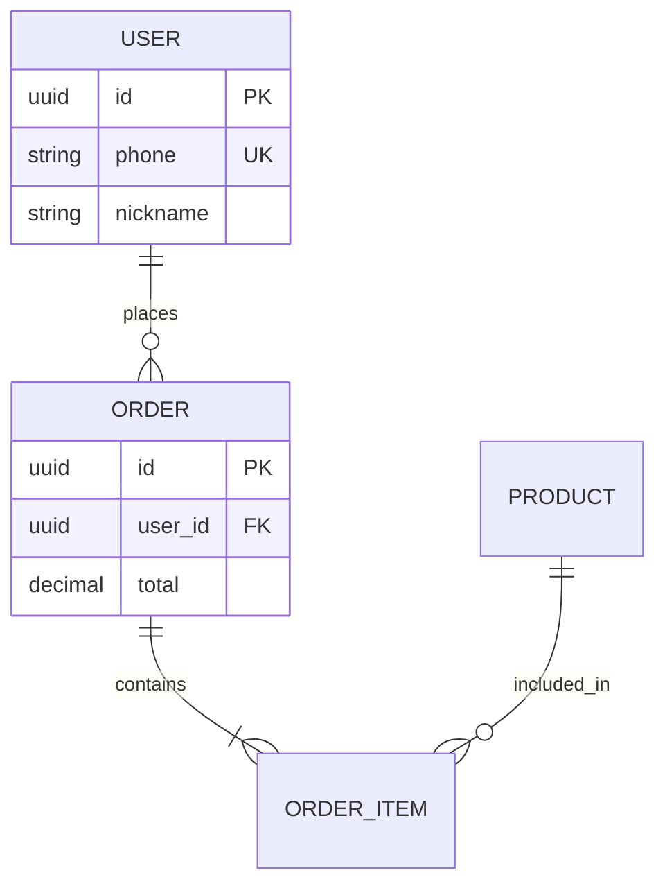

# 文档生成模块 验收标准

## 验收清单

### 功能验收

| ID | 功能点 | 验收标准 | 测试方法 |
|----|--------|---------|---------|
| AC-101 | 触发PRD生成 | 输入"生成PRD"触发流程 | 手动 |
| AC-102 | 前置条件检查 | 检查需求文档完整性 | 自动 |
| AC-103 | 数据收集 | 读取所有需求文档 | 自动 |
| AC-104 | 业务实体识别 | AI识别核心实体 | 手动验证 |
| AC-105 | ER图生成 | 生成业务实体关系图 | 手动验证 |
| AC-106 | Mermaid源码保存 | 保存.mmd文件 | 自动 |
| AC-107 | 图片渲染 | 渲染PNG图片 | 自动 |
| AC-108 | PRD.md生成 | 生成完整自包含PRD | 手动验证 |
| AC-109 | 资源文件整理 | 图片和源码正确组织 | 自动 |
| AC-110 | README生成 | 生成使用说明 | 自动 |

### 非功能验收

| ID | 类型 | 验收标准 | 测试方法 |
|----|------|---------|---------|
| NFR-101 | 性能 | PRD生成<30秒 | 性能测试 |
| NFR-102 | 可靠性 | 失败有降级方案 | 异常测试 |
| NFR-103 | 可读性 | PRD易读无格式错误 | 人工审阅 |
| NFR-104 | 完整性 | 包含所有必要章节 | 检查清单 |

---

## 详细验收标准

### AC-101: 触发PRD生成

**Given**
- 需求分析阶段已完成
- 用户在 Claude Code 中

**When**
- 用户输入 "生成PRD"

**Then**
- [ ] requirements-analyzer Skill 识别指令
- [ ] 调用 PRD Generator 程序
- [ ] 显示进度提示

---

### AC-102: 前置条件检查

**Given**
- 用户触发了 PRD 生成

**When**
- 系统检查前置条件

**Then**
- [ ] 检查 `docs/00-项目概览.md` 存在
- [ ] 检查 `docs/01-模块划分.md` 存在
- [ ] 检查 `docs/02-用户故事.md` 存在
- [ ] 如有缺失，显示清晰错误提示
- [ ] 列出缺失的文档清单

**错误提示示例**：
```
❌ 无法生成 PRD: 需求文档不完整

缺失文档:
  - docs/00-项目概览.md
  - docs/01-模块划分.md

请先完成需求分析流程:
  输入: "我想做..." 开始需求分析
```

---

### AC-103: 数据收集

**Given**
- 前置条件检查通过
- docs/ 目录结构如下:
```
docs/
├── 00-项目概览.md
├── 01-模块划分.md
├── 02-用户故事.md
└── modules/
    ├── 模块A/
    │   ├── 03-核心流程.md
    │   ├── 04-原型设计.md (可选)
    │   └── 05-验收标准.md
    └── 模块B/
        └── ...
```

**When**
- Collector 程序执行

**Then**
- [ ] 成功读取所有 Markdown 文件
- [ ] 解析文件内容为结构化数据
- [ ] 提取 Mermaid 代码块
- [ ] 提取图片引用
- [ ] 返回数据清单对象
- [ ] 显示进度: `✓ 已收集 N 个文档`

---

### AC-104: 业务实体识别

**Given**
- 数据收集完成
- 存在验收标准和核心流程文档

**When**
- AI 分析业务模型

**Then**
- [ ] 识别出核心业务实体（如: 用户、订单、商品）
- [ ] 识别实体属性（字段名、类型）
- [ ] 识别实体关系（1:1, 1:N, N:M）
- [ ] 生成合理的实体关系描述

**示例输出**：
```
🤖 AI 识别到以下实体:
  - 用户 (User): 5个字段
  - 订单 (Order): 8个字段
  - 商品 (Product): 6个字段
  - 订单项 (OrderItem): 4个字段

  关系:
  - 用户 ← 1:N → 订单
  - 订单 ← 1:N → 订单项
  - 商品 ← N:M → 订单项
```

---

### AC-105: ER图生成

**Given**
- AI 已识别实体

**When**
- AI 生成 Mermaid ER 图代码

**Then**
- [ ] 生成符合 Mermaid 语法的代码
- [ ] 包含所有核心实体
- [ ] 包含实体属性定义
- [ ] 包含关系连线
- [ ] 标注主键 (PK) 和外键 (FK)
- [ ] 代码格式清晰易读

**示例 Mermaid 代码**：


---

### AC-106: Mermaid代码嵌入

**Given**
- Mermaid 代码已生成

**When**
- 嵌入到 PRD.md

**Then**
- [ ] 代码块在对应图片后面
- [ ] 使用 `<details>` 标签折叠
- [ ] 使用 ```mermaid 代码块
- [ ] 代码格式清晰易读
- [ ] 包含简短说明

---

### AC-107: 图片渲染

**Given**
- Mermaid 源码已保存
- 系统已安装 mermaid-cli 或等效工具

**When**
- 渲染图片

**Then**
- [ ] 创建 `docs/PRD/assets/images/` 目录
- [ ] 渲染为 PNG 格式
- [ ] 图片宽度 >= 800px
- [ ] 图片清晰可读
- [ ] 文件名与源码文件一致: `business-entity-diagram.png`
- [ ] 如果渲染失败，记录错误但不阻止流程

---

### AC-108: PRD.md生成

**Given**
- 所有数据和图片准备完成

**When**
- AI 生成 PRD.md

**Then**
- [ ] 文件创建在 `docs/PRD/PRD.md`
- [ ] 包含完整的文档结构:
  - [ ] 标题和元信息
  - [ ] 目录
  - [ ] 1. 产品概述
  - [ ] 2. 业务模型（含实体关系图）
  - [ ] 3. 功能规划
  - [ ] 4. 核心功能详解（每个模块）
  - [ ] 5. 非功能需求（性能、可用性、可维护性）
  - [ ] 6. 项目规划
  - [ ] 附录（术语表、变更记录）
- [ ] 图片引用路径正确: `./assets/images/xxx.png`
- [ ] Mermaid 代码直接嵌入在 `<details>` 中
- [ ] Markdown 格式正确无错误
- [ ] 内容自包含，可独立阅读
- [ ] 不包含参考文档章节
- [ ] 不包含兼容性要求章节

---

### AC-109: 资源文件整理

**Given**
- PRD.md 已生成
- 原始文档中有原型图

**When**
- 整理资源文件

**Then**
- [ ] 复制所有原型图到 `assets/images/`
- [ ] 渲染后的流程图保存到 `assets/images/`
- [ ] 图片文件名规范化
- [ ] 目录结构清晰:
```
PRD/
├── PRD.md (包含嵌入的 Mermaid 代码)
├── README.md
└── assets/
    └── images/
        ├── business-entity-diagram.png
        ├── flow-order-0.png
        └── prototype-login.png
```

---

### AC-110: README生成

**Given**
- PRD 生成完成

**When**
- 生成 README.md

**Then**
- [ ] 文件创建在 `docs/PRD/README.md`
- [ ] 包含文件说明
- [ ] 包含使用指南
- [ ] 包含图表编辑说明
- [ ] 包含导出PDF指引
- [ ] 包含生成时间和工具信息

---

## 边界条件测试

### BC-101: 模块文档缺失

| 测试场景 | 缺失文档 | 预期结果 |
|---------|---------|---------|
| 缺少核心流程 | 03-核心流程.md | ⚠️ 警告，跳过该模块流程图 |
| 缺少原型设计 | 04-原型设计.md | ✅ 正常（本就可选） |
| 缺少验收标准 | 05-验收标准.md | ⚠️ 警告，跳过该模块验收标准 |
| 所有模块文档缺失 | modules/ 为空 | ❌ 错误，无法生成 PRD |

### BC-102: Mermaid 渲染失败

| 测试场景 | 失败原因 | 预期结果 |
|---------|---------|---------|
| 语法错误 | Mermaid 代码有误 | ⚠️ 警告，PRD中保留代码块 |
| 渲染工具缺失 | 未安装 mermaid-cli | ⚠️ 警告，PRD中保留代码块 |
| 渲染超时 | 图表过于复杂 | ⚠️ 警告，PRD中保留代码块 |

### BC-103: AI 调用失败

| 测试场景 | 失败原因 | 预期结果 |
|---------|---------|---------|
| API 超时 | 网络问题 | ❌ 错误，提示重试 |
| Token 限制 | 内容过长 | ⚠️ 警告，使用模板填充 |
| API 配额用尽 | 达到限制 | ❌ 错误，提示稍后重试 |

---

## 质量验收

### QA-101: PRD 可读性检查

**检查项**:
- [ ] 无 Markdown 语法错误
- [ ] 图片链接有效
- [ ] 表格格式正确
- [ ] 列表缩进正确
- [ ] 标题层级合理
- [ ] 无错别字

**检查方法**: 使用 Markdown Linter 工具

### QA-102: PRD 完整性检查

**必须包含的章节**:
- [ ] 产品概述
- [ ] 业务模型
- [ ] 功能规划
- [ ] 核心功能详解
- [ ] 非功能需求
- [ ] 项目规划

**必须包含的图表**:
- [ ] 业务实体关系图
- [ ] 模块关系图（如有）
- [ ] 至少1个业务流程图

### QA-103: 资源文件完整性

**检查项**:
- [ ] 所有图片文件存在
- [ ] 所有 .mmd 源码文件存在
- [ ] 文件命名规范
- [ ] 没有孤立的图片（PRD中未引用）
- [ ] 没有断链（引用但文件不存在）

---

## 性能验收标准

| 操作 | 性能目标 | 实测结果 | 状态 |
|------|---------|---------|------|
| 数据收集 | < 1秒 | ⏱️ 待测 | - |
| AI 分析 | < 10秒 | ⏱️ 待测 | - |
| 单图渲染 | < 5秒 | ⏱️ 待测 | - |
| 5张图渲染 | < 20秒 | ⏱️ 待测 | - |
| 完整 PRD 生成 | < 30秒 | ⏱️ 待测 | - |
| 内存占用 | < 200MB | 📊 待测 | - |

---

## 用户满意度验收

### 产品团队反馈

**问卷问题**:
1. PRD 是否包含你需要的所有信息？ (1-5分)
2. PRD 结构是否清晰易读？ (1-5分)
3. 业务实体关系图是否准确？ (1-5分)
4. 是否愿意将此 PRD 分享给团队？ (是/否)
5. 还缺少哪些内容？ (开放问题)

**目标**:
- 平均分 >= 4.0
- 愿意分享率 >= 80%

---

**文档版本**: v1.0
**创建日期**: 2025-12-10
